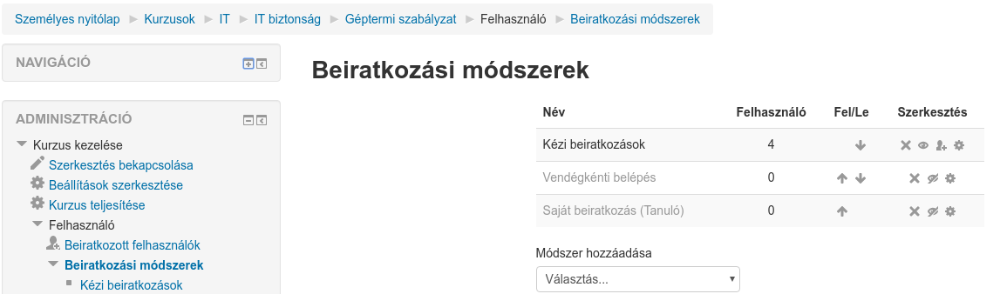

:icons: font
:experimental: enable
:toc: right
:doctype: book

[[beiratkoztatas]]
= Beiratkoztatás

A fejezetben bemutatjuk, hogyan tudunk:

* kurzus beiratkoztatási módszereit megadni
* önálló beiratkoztatást engedélyezni
* felhasználót kézzel beiratkoztatni
* globális csoportot beiratkoztatni
* felhasználók kurzuson belüli szerepét meghatározni

A Moodle több lehetőséget biztosít, hogy a felhasználók be tudjanak iratkozni a létrehozott kurzusokba. A beiratkozással egyrészt a tanulók jogot szereznek a tartalom megtekintésére, másrészt haladási információjuk el lesz tárolva a kurzusnál.

Egy kurzushoz több beiratkoztatási módszert is beállíthatunk, ezt a menu:Kurzus kezelése[Felhasználó > Beiratkoztatási módszerek] menüpont alatt tudjuk megtenni.

Alapértelmezésben csak a *Kézi beiratkoztatások* van bekapcsolva egy kurzusnál, de a szem ikonnal a leszűrkítetteket is engedélyezhetjük, illetve *Módszer hozzáadása* segítségével további módszereket adhatunk hozzá a kurzushoz. Az egyes beiratkoztatási módszerekhez további beállítási lehetőségek tartozhatnak (fogaskerék ikon).

A fő beiratkoztatási módszerek a következők:

* Kézi beiratkoztatás
* Saját beiratkoztatás
* Globális csoport

NOTE: Az adminisztrátorok a menu:Portál adminisztráció[Segédprogramok > Beiratkoztatási segédprogramok kezelése] alatt további speciális beiratkoztatási módszereket engedélyezhetnek.

<<<

[[kezi-beiratkoztatas]]
== Kézi beiratkoztatás

Ezzel a módszerrel a kurzus tanárai, illetve az igazgatók tudnak kézzel egyenként beiratkoztatni felhasználókat, illetve a beiratkoztatott felhasználókhoz kurzuson belüli szerepet rendelni.

A beiratkozott felhasználók felület megnyitásához kattintsunk a menu:Kurzus kezelése[Felhasználó > Beiratkozott felhasználók] menüpontra.

image::./pics/kurzus/beiratkoztatas_beiratkozottak.png[align="center"]

A felületen egyrészt látjuk a jelenleg beiratkoztatott felhasználókat, másrészt további felhasználókat tudunk beiratkoztatni.

NOTE: Ezen a felületen nem csak a kézzel beiratkoztatott felhasználók jelennek meg, a listában látszik, hogy egy-egy felhasználó milyen beiratkoztatási módszerrel került beiratkoztatásra.

A beiratkozott felhasználóknál a *Szerepek* alatt láthatjuk a kurzusban betöltött szerepkörüket, illetve a "plusz" ikontra kattintva további szerepeket adhatunk hozzá, illetve a szerepeket meg is vonhatjuk.

Új felhasználó beiratkoztatásához kattintsunk a btn:[Felhasználók beiratkoztatása] gombra.

image::./pics/kurzus/beiratkoztatas_kezi_beiratkoztatas.png[align="center"]

A megjelenő felületen a *Szerepek hozzárendelése* segítségével tudjuk megadni, hogy a beiratott felhasználó milyen szerepet kapjon, majd a btn:[Beirat] gombra kattintva tudjuk beiratkoztatni a felhasználót.

A *Beiratkoztatási lehetőségek* alatt például meg tudjuk adni, hogy mikortól legyen beíratva a felhasználó, illetve meddig.

TIP: *A felhasználó korábbi osztályzatainak visszanyerése, ha lehetséges* opció akkor jó, ha egy felhasználó leiratkozott egy kurzusról, de emiatt elvesztek a kurzuseredményei. Ha úgy íratjuk vissza kézzel, hogy ezt az opciót bejelöljük, akkor a kurzuspontjai újra megjelennek.

== Saját beiratkoztatás

Amennyiben a beiratkoztatási módszereknél engedélyeztük ezt a módszert, a tanulók szabadon fel tudják venni, illetve le tudják adni a kurzust.

A beiratkoztatási módszer beállításainál sok finomhangolást végezhetünk például meg tudjuk adni, hogy meddig iratkozhatnak be a felhasználók, megadhatjuk, hogy csak jelszóval léphessenek be stb.

image::./pics/kurzus/beiratkoztatas_sajat_beiratkoztatas_beallitasok.png[align="center"]

WARNING: Alapértelmezésben a tanulók leadhatják a kurzust, viszont amikor újra felveszik, a kurzusosztályzatok nem jönnek vissza. Ilyenkor csak a <<kezi-beiratkoztatas,Kézi beiratkoztatásnál>> részletezett módon nyerhetjük vissza az osztályzatot. A problémát elkerülhetjük, ha letiltjuk a kurzus leadását akár portál szinten a `enrol/self:unenrolself` jogosultság megvonásával.

<<<

== Globális csoport

A *Beiratkoztatási módszereknél* ha a *Módszer hozzáadása* alatt a *Globális csoport szinkronizálása* opciót választjuk, akkor portálszintű globális csoportot tudunk beiratkoztani a kurzushoz. Ez azért jó, mert ha például új felhasználó kerül be a csoportba, akkor őt nem kell kézzel beiratkoztatni a kurzusra, hanem automatikusan bekerül a beiratkozottak közé. Ez igaz kiiratkozásra is.

A módszer hozzáadásánál a *Globális csoportot* kötelező megadni, a többi beállítás opciónális. Megadhatjuk például, hogy a beiratott felhasználók milyen szerepet kapjanak, vagy a kurzuson belül milyen csoportba kerüljenek.

image::./pics/kurzus/beiratkoztatas_globalis_csoport.png[align="center"]
