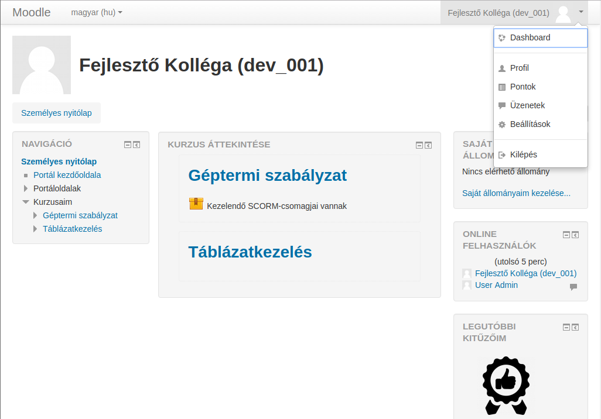
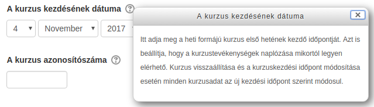
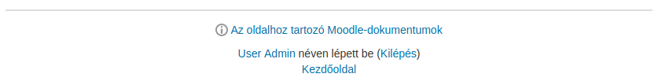

:icons: font
:experimental: enable
:toc: right

= Bevezető

== Áttekintés

A dokumentum a következő fő részeken keresztül mutatja be a Moodle funkcióit:

* Megnézzük, hogy mi a Moodle és mi a célja,
* áttekintjük a Moodle-ban használt felhasználói szerepeket,
* megnézzük a felület általános felépítését,
* megismerkedünk a kurzusok és tevékenységek általános létrehozásával és beállításaival,
* ismertetjük a főbb tevékenységtípusokat,
* ismertetjük a kurzuson belüli pontozás és lekérdezés lehetőségeit,
* megnézzük, hogyan tudjuk a rendszer felhasználói kezelni,
* megnézzük, hogy tudjuk őket beiratkoztatni kurzusra,
* végül megismerkedünk a kitűzőkkel.

NOTE: A dokumentum Moodle 3.0-ás verzió alapján készült, de a leírtak alkalmazhatóak magasabb számú verziókra is.

<<<

== Mi a Moodle?

A Moodle (Modular Object-Oriented Dynamic Learning Environment) egy nyílt forráskódú, *online tanulásirányítási környezet* (LMS - Learning Management System), mely segítséget ad az oktatóknak az oktatás szervezésében, tananyagok egyszerű hozzáférhetővé tételében, illetve szabadságot ad a résztvevőknek, melynek segítségével térben és időben el tudnak szakadni a hagyományos frontális (osztálytermi) tanulástól.

Az LMS feladata, hogy azonosítsa a résztvevőket, és szerepkörük, jogosultságaik szerint a megfelelő tananyagokkal (kurzusokkal) összerendelje őket.

Az alkalmazás a felhasználók tevékenységeit, a tanulás szempontjából fontos adatokat naplózza, melyekből a későbbiekben statisztikák generálhatók.
Ezek az adatok egyrészt a tanulók haladásával kapcsolatosan szolgáltatnak fontos információkat, másrészt a tananyag hatékonysága is kideríthető belőlük.

A fontosabb feladatok összefoglalva:

* Nyilvántartja a résztvevőket és eredményeiket.
* Hozzáférést biztosít a kurzusok különböző anyagaihoz, elemeihez.
* Naplózza a résztvevők: adminisztrátorok, oktatóoktatók, trénerek, résztvevők tevékenységét.
* Rendszerint elsődleges kommunikációs felületet biztosít az oktatáshoz.
* Támogatja az oktatói értékelést (formatív és szummatív értékelést egyaránt).
* Önértékelő és számon kérő elemeket tartalmaz.
* Támogatja a virtuális csoportmunkát, kollaboratív felületet biztosít.

<<<

== Szerepek a Moodle-ban

A Moodle-ban a különböző jogosultságok szerepekhez kapcsolódnak. Ezek elnevezése és a hozzá kapcsolódó jogosultságok szintje különböző lehet.

A leggyakoribb szerep elnevezések:

::
Adimisztrátor-rendszergazda:::
Az adminisztrátor a legmagasabb rangú személy a keretrendszer résztvevői közül. Adott esetben ő látja el a keretrendszert futtató szerver karbantartását is, de lényegesebb az, hogy ő felel a keretrendszer szabályos működéséért.

Igazgató:::

Az igazgató még el tud érni a rendszerrel kapcsolatos adminisztrációs funkciókat, de ezek leginkább a portál tartalmi megjelenésére vonatkoznak. Továbbá szabadon kezelhetik a rendszer kurzusait és felhasználóit.

Kurzuskészítő:::

A kurzuskészítő a legmagasabb rangú oktató. Ez az oktatói csoport rendelkezik egyedül kurzusdefiniálási joggal. A kurzuskészítő minden általa létrehozott kurzust lát, és képes szerkeszteni. Képes oktatókat hozzárendelni a kurzushoz és meghatározni sorrendjüket. A kurzuskészítő – mint oktató – teljes körűen menedzselheti kurzusait, azaz oktatói minőségben is eljárhat.

Tanár / Oktató:::

A Moodle-ban alapjában véve bárki lehet tanár, akit egy megfelelő joggal rendelkező személy hozzárendel egy kurzushoz. Tanároknak azokat tekintjük, akik kurzusok menedzselését, karbantartását végzik (egyedül vagy többedmagukkal). A tanár tölti fel a tananyagokat, tananyagelemeket, szabályozza a tananyag felhasználását, hozzáférhetőségét (láthatóságát), valamint különböző jellegű tevékenységeket szervez, feladatokat ad a résztvevők számára.

Tutor (Nem szerkesztő tanár):::

Tutornak tekintjük azokat az „oktatókat”, akik nem rendelkeznek szerkesztési joggal a kurzusban. Nem tudnak újabb tananyagelemeket hozzárendelni a kurzushoz, sem újabb tevékenységeket, feladatokat adni a hallgatóknak. Ugyanakkor részesei lehetnek az adminisztrációnak, értékelhetik a hallgatók tevékenységét, feltöltött feladataikat, s joguk van megtekinteni a hallgatók osztályzatait.

Tanuló / Résztvevő:::

A résztvevő az, aki hallgatói tevékenységet folytat a rendszerben. Feldolgozza a számára biztosított tananyagot, teljesíti a számára előírt feladatokat, végrehajtja azokat a
tevékenységeket, amelyeket teljesítenie kell.

<<<

::
Vendég:::

Időközönként előfordulhat, hogy olyan személyeket engedünk be egy-egy kurzusba, akik felhasználóként nem léteznek a rendszerben. Nem szeretnénk, hogy tartósan résztvevői legyenek kurzusunknak, hanem csak szeretnénk bemutatni nekik kurzusunk (rendszerünk) működését. Ezek a személyek a vendégek. A vendégek beengedéséről az adott kurzus tulajdonosa (egy kurzuskészítő vagy adminisztrátor) dönt, s a kurzus beállításainak módosításával határozza meg a vendégekre vonatkozó szabályt.

NOTE: Ezen kívül van még a *Hitelesített felhasználó* és a *Hitelesített felhasználó a kezdőoldalon* szerepkör. A *Hitelesített felhasználó* szerepkört megkapja minden bejelentkezett felhasználó. Ha ezen felhasználók a kezdőoldalon vannak, akkor a *Hitelesített felhasználó a kezdőoldalon* szerepkört kapják meg.

<<<

== A Moodle felülete

Miután a felhasználó bejelentkezik a Moodle-be, a következő felületet látja:

.Dashboard

A felépítés a következő:

* Az oldal felső részén található a fejléc, itt található a nyelvválasztó, illetve a személyes lenyíló menü, ahonnan elérjük a tanulási előmenetelünkkel és a profilunkkal kapcsolatos funkciókat.
* A fejléc alatt található az aktuális oldal címe, alatta pedig a breadcrumb (kenyérmorzsa), amely mutatja, hogy éppen hol vagyunk a felületen.
* A gyakran frissített vagy fontos információk a képernyő közepén találhatóak.
* A bal és jobb oldalon találhatóak a blokkok. Bal oldalon alapértelmezésben a navigációs menü blokkja található, ahonnan a felhasználó elérheti kurzusait. Az adminisztrátorok számára itt jelenik meg az adminisztrációs menü is. A jobb oldalon alapértelmezésben általános információkat tartalmazó blokkok találhatóak - például naptár, kitűzőim.
+
TIP: A felhasználó testreszabhatja, hogy milyen blokkok jelenjenek meg a főoldalon, illetve az egyes kurzusok oldalain. Ehhez kattintsunk az oldal jobb felső részében található btn:[Oldal testreszabása] gombra.

<<<

== Súgó

A Moodle rendszer használata során felmerülő problémákat a súgó  segítségével is megoldhatja. A karikában lévő kérdőjelre kattintva  éri el a súgót, ami felugró ablakban mutatja az idevonatkozó segítséget, illetve további súgó tartalmakat jeleníthet meg.

.Súgó ikon

Az adott oldalhoz kapcsolódó részletes angol nyelvű leírást a minden oldal alján megjelenő *Az oldalhoz tartozó Moodle-dokumentumok* linkkel tudjuk elérni.

.Súgó az oldal alján

