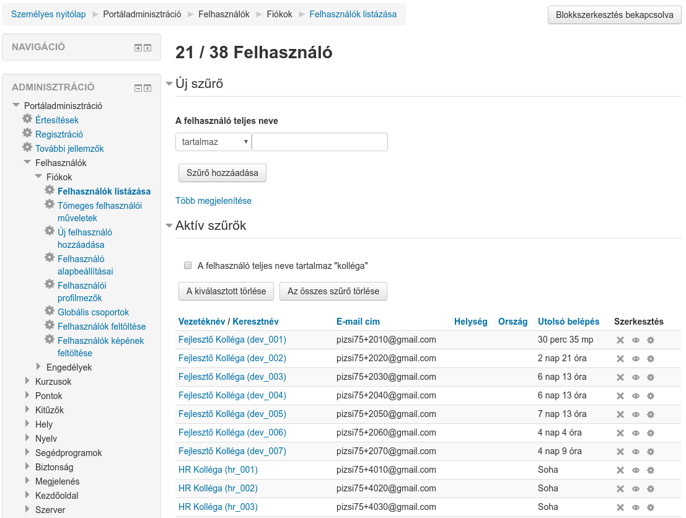
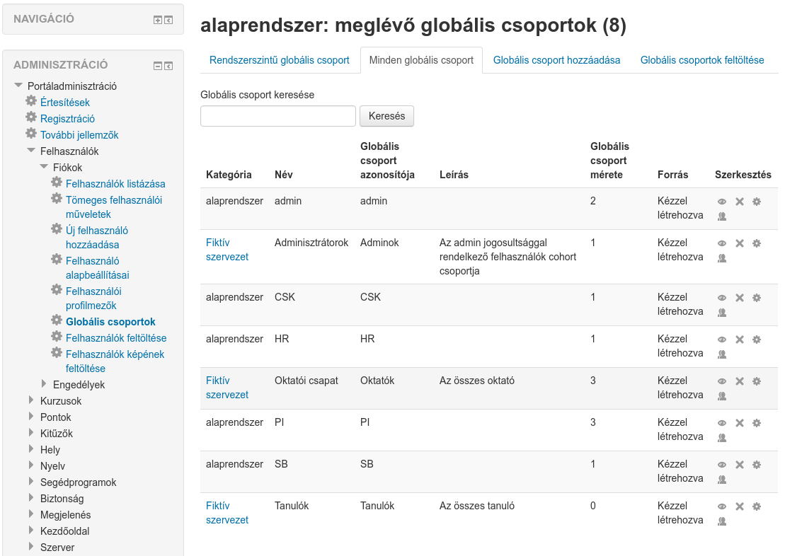

:icons: font
:experimental: enable
:toc: right
:doctype: book

[[felhasznalokezeles]]
= Felhasználókezelés

A fejezetben bemutatjuk, hogyan tudunk:

* felhasználókat létrehozni
* keresni
* rendszerszintű jogosultsággal felruházni
* globális csoportot létrehozni
* felhasználókat Excelből importálni

A Moodle több lehetőséget biztosít a felhasználóink felvételére a rendszerbe. Például össze tudjuk kötni Active Directory-val, támogat önregisztrációt stb. Ezeket *Hitelesítési eljárásoknak* hívjuk. Az alapértelmezett, kézzel létrehozott felhasználók hitelesítési eljárása a *Kézi fiókok*. További hitelesítési eljárás beállítások a menu:Portáladminisztráció[Segédprogramok > Hitelesítés] alatt érhetőek el.

== Felhasználók listázása és új felhasználó létrehozása

A portál felhasználóit listázni, illetve új felhasználót kézzel felvenni a menu:Portáladminisztráció[Felhasználók > Fiókok > Felhasználók listázása] alatt tudunk.

A felületen a felhasználókat több mező alapján tudjuk szűrni (menu:Új szűrő[Több megjelenítése]), egyszerre több szűrőfeltételt is megadva.

A felület alján található btn:[Új felhasználó hozzáadása] gombra kattintva hozhatunk létre új felhasználót. Itt meg kell adnunk a kötelezően kitöltendő mezőket (felhasználónév, jelszó, email, vezetéknév, keresztnév), és ezeken kívül további opcionális mezőket is kitölthetünk, például képet tölthetünk fel a felhasználóhoz, beállíthatjuk az alapértelmezett nyelvét vagy az időzónát.

TIP: Amennyiben tartozik a felhasználóhoz szervezetünkön belül valamilyen egyedi azonosító, azt az *Azonosítószám* mezőben adjuk meg.

TIP: Egyedi profilmezőket is felvehetünk a menu:Portáladminisztráció[Felhasználók > Fiókok > Felhasználói profilmezők]

== Tömeges felhasználói műveletek

A menu:Portáladminisztráció[Felhasználók > Fiókok > Tömeges felhasználói műveletek] alatt kiválaszthatunk több felhasználót, majd a kiválasztott felhasználókkal csoportos műveletet hajthatunk végre, pl. törölhetjük őket egyszerre vagy üzenetet írhatunk nekik.

A menu:Portáladminisztráció[Felhasználók > Fiókok > Felhasználók képének feltöltése] alatt feltölthetünk egy .zip fájlt, ami tartalmazza a felhasználónk képeit. A képek fájlneve lehet pl. a felhasználók felhasználóneve.

<<<

== Globális csoportok

A globális csoportok segítségével a felhasználókat csoportokba sorolhatjuk, mely csoportokat később felhasználhatjuk pl. kurzusoknál történő beiratkoztatáshoz.

TIP: Globális csoportot létrehozhatunk portálszinten, de létrehozhatunk kurzuskategória szinten is.

A globális csoportok szerkesztéséhez válasszuk a menu:Portáladminisztráció[Felhasználók > Fiókok > Globális csoportok] menüpontot.

A *Minden globális csoport* alatt láthatjuk mind a rendszerszintű, mind az egyes kurzuskategóriákhoz rendelt csoportokat.

A *Globális csoport hozzáadása* fül segítségével kézzel létrehozhatjuk a csoportot, de akár Excelből is feltölthetjük a *Globális csoportok feltöltése* segítségével.

NOTE: Excelből való feltöltéskor csak a csoportok alapadatait tudjuk feltölteni, itt a felhasználókat nem tudjuk hozzárendelni. A hozzárendelést Excelből a *Felhasználók feltöltése* menüpont alatt tudjuk megtenni.

A csoportok listájában a *Szerkesztés* alatt található  gomb segítségével tudjuk a csoport felhasználóit kézzel hozzárendelni.

== Felhasználók feltöltése

include::./felhasznalok-importalasa.adoc[leveloffset=+1]

== Engedélyek

A Moodle kifinomult jogosultsági rendszerrel rendelkezik, minden egyes művelethez külön jog szükséges, ezeket *Engedélyeknek* nevezzük. Ilyen pl. egy tevékenység megjelenítési jog, vagy egy feltöltési jog. A felhasználók ilyen engedélyekkel rendelkeznek, de azért, hogy ne kelljen minden felhasználóhoz ezeket az engedélyeket külön megadni, ezeket *Szerepekbe* csoportosítjuk és a felhasználókhoz ezeket a szerepeket rendeljük hozzá. Különböző szinteken lehet szerepekhez rendelni felhasználókat. Ilyen szint például a portálszint, kurzuskategória vagy kurzus szint.

NOTE: A rendszer által szolgáltatott szerepek általában elegendőek, de amennyiben nem, új szerepet tudunk definiálni a menu:Portáladminisztráció[Felhasználók > Engedélyek > Szerepek meghatározása] alatt.

A menu:Portáladminisztráció[Felhasználók > Engedélyek] alatt tudjuk meghatározni a *Portálszintű rendszergazdákat*, illetve a *Rendszerszerepek hozzárendelése* alatt tudunk *Igazgató*, illetve *Kurzuskészítő* joggal felruházni felhasználókat.

TIP: A *Rendszerengedélyek ellenőrzése* alatt tudjuk lekérdezni, hogy egy adott felhasználónak milyen engedélye van rendszerszinten. De például ha belépünk egy kurzusba, ugyanezt meg tudjuk tenni kurzusszinten a menu:Kurzus kezelése[Felhasználó > Engedélyek > Engedélyek ellenőrzése] alatt.

