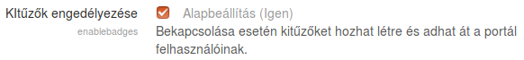
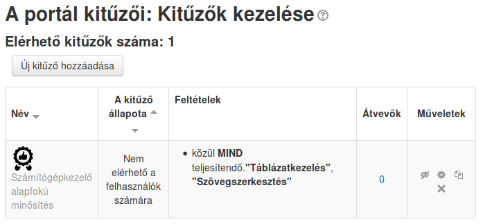
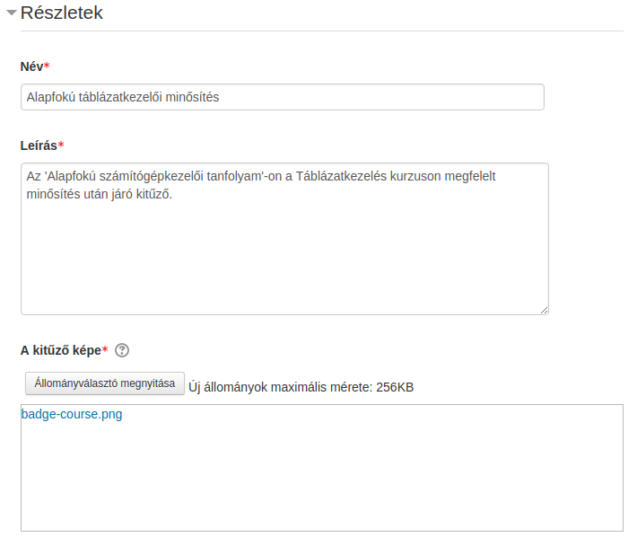
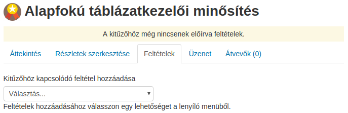
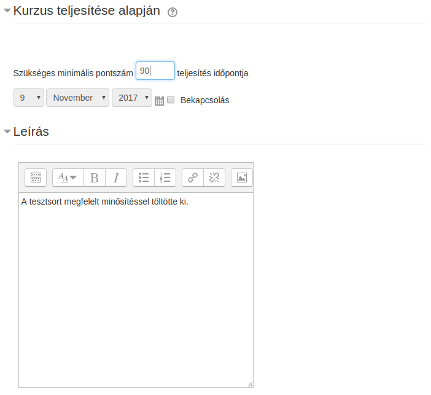
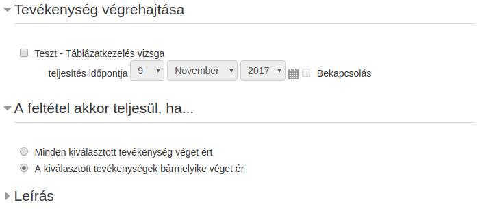
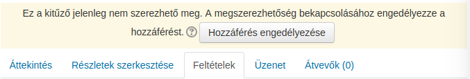
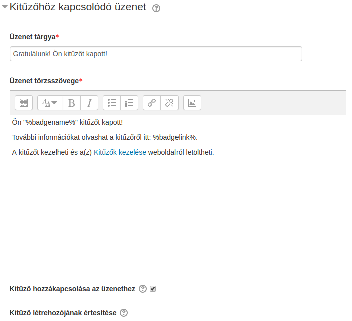

:icons: font
:experimental: enable
:toc: right
:toclevels: 3

= Kitűzők

== Áttekintés

A kitűző egy lehetséges módja annak, hogy megünnepeljük, jutalmazzuk az eredményeket, vagy épp ösztönözzük a résztvevőket.

A kitűzők kiválasztott kritériumok alapján szerezhetők meg, illetve adományozhatók.

A kitűzőknek két kategóriája létezik:

::
Kurzuskitűzők::: A kurzuson belül létrehozott kitűzök a kurzusba beiratkozott résztvevők számára adhatók, és a kurzuson belül zajló tevékenységekhez kapcsolódnak. Például a kurzuson belüli egy vagy több tevékenység sikeres teljesítése után kap a résztvevő egy kitűzőt.

Portál szintű kitűzők::: Jellemzően a portál egészére kiterjedő tevékenységekhez kapcsolódnak ezek a kitűzők. Például három kurzus elvégzése után kap a résztvevő kitűzőt.

== Kitűzők kezelése

A kitűzők kezelése lehetséges kurzus vagy portál szinten.

NOTE: A kurzus tanárai alapértelmezésben nem férnek hozzá a portál szintű kitűzőkhöz, hacsak nem kaptak rendszerszintű szerepet a kitűzők kezelése képességhez (__Kitűző globális beállításainak kezelése__).

=== Kurzuskitűzők kezelése

NOTE: Ahhoz, hogy a tanárok elérjék kurzus szinten a kitűzőket, adminisztrátoként engedélyeznünk kell a menu:Portáladminisztráció[Kitűzők > Kitűző beállításai] menüpont alatt a *Kurzuskitűzők bekapcsolása* tulajdonságot.

Tanárként a kurzushoz tartozó adminisztrációs panelen a menu:Kurzus kezelése[Kitűzők > Kitűzők kezelése] menüpont kiválasztásával meg tudjuk tekinteni a kurzus alatt elérhető kitűzők listáját, valamint a rájuk elvégezhető műveleteket.

.Kitűzők kezelése
image::./pics/kituzok/kituzok-kurzus-kezelese-muveletek.png[align="center"]

A kitűzőkön végezhető műveletek::

Hozzáférés engedélyezése / kikapcsolása image:./pics/kituzok/kituzok-muveletek-engedelyezes.png[] / image:./pics/kituzok/kituzok-muveletek-kikapcsolas.png[]:::
A hozzáférés engedélyezése és kikapcsolása műveletek elérhetősége a kitűző aktuális állapotától függ. Például ha egy kitűző elérhető a felhasználók számára, megjelenik a image:./pics/kituzok/kituzok-muveletek-kikapcsolas.png[title="hozzáférés kikapcsolása"] ikon.
+
+
Amíg nem adunk meg feltételt a kitűzőhöz, addig a hozzáférés engedélyezése ikon sem jelenik meg a kitűzőhöz tartozó műveletek között.
+
+
A kitűző hozzáférésének kikapcsolásával a felhasználók elől elrejtve marad a kitűző. Amikor hozzáférhetővé tesszük, előfordulhat, hogy egyes résztvevők máris teljesítik a kitűző által meghatározott feltételeket, ezért azonnal meg is kapják.

Kitűzők szerkesztése :::

A megszerzett kitűzőt a rendszer zárolja, így egyes beállításait (pl. a feltételeket és a lejáratot) ezt követően nem módosíthatjuk.

Kitűzők törlése :::

A kitűző törlését a  ikonra klikkeléssel lehet kezdeményezni. Ezt követően választhatunk a törlés módját illetően:

.A kitűző törlése és a már kiadott kitűzők megtartása
image::./pics/kituzok/kituzok-muveletek-torles-megmarad.png[align="center"]

.A kitűző törlése az összes kiadott kitűzővel együtt
image::./pics/kituzok/kituzok-muveletek-torles-mind.png[]

Kitűzők másolása ::::

A másolás ikonra klikkelve a rendszer létrehoz egy másolatot a kitűzőről és megnyitja a másolatot szerkesztésre. A kitűző neve mögé illeszti a 'másolata' szót, így különböztetve meg az eredetitől. A rendszer nem engedi, hogy ugyanolyan névvel egynél több kitűzőt illessünk.

=== Portál szintű kitűzők kezelése

[NOTE]
--
Ahhoz, hogy portál szinten tudjuk használni a kitűzőket, be kell kapcsolnunk az menu:Adminisztráció[Portáladminisztráció > További jellemzők] menüpontban a *Kitűzők engedélyezése* tulajdonságot.
Ezt követően megjelenik az menu:Adminisztráció[Portáladminisztráció > Kitűzők > Kitűzők kezelése] menüpont.

.kitűzők bekapcsolása rendszer szinten

--

A kurzuskitűzőknél megismert műveletek érvényesek a portál szintű kitűzőkre is.

.Portál szintű kitűzők kezelése

Azon kitűzők esetében, ahol a kritériumok között a *kézi adományozás szerep* található, egy felhasználó egy másik felhasználó számára adhat kitűzőt. A kitűzőt kibocsátó felhasználóknak "moodle / badges: awardbadge" képességgel kell rendelkezniük. A webhely adminisztrátorai a kitűző megadásakor / szerkesztésekor meghatározhatják ezen szerepeket.

.Kitűző kézi adományozás szerep alapján
image::./pics/kituzok/kituzok-portal-kezi-szerep-kivalasztas.png[align="center"]

== Kitűzők használata

Ez a fejezet azt mutatja be, hogyan lehet kitűzőket adni kurzushoz vagy webhelyhez (portál szintű kitűző).

=== Új kurzuskitűző felvétele

Ha a kurzuskitűzők engedélyezve vannak rendszer szinten, a tanárok kitűzőket tudnak a kurzushoz felvenni.

Amikor új kitűzőt veszünk fel, első körben a kitűző részleteit kell megadnunk.

==== Részletek

::
Részletek::: Meg kell adnunk a kitűző nevét, leírását és fel kell töltenünk egy kitűzőt.

Az adományozó adatai::: Ide például megadhatjuk a tanár nevét, mely megjelenik a résztvevőnél a kitűző megjelenésekor. A kapcsolat (pl. email cím) megadása opcionális.

A kitűző lejárata:::  A kitűző érvényességi idejét adhatjuk meg. Soha nem jár le, egy rögzített időpontban jár le, vagy a kiállítás napja a beállított értéknek megfelelő nap elteltével veszti el a kitűző érvényességét.
+

==== Feltételek

A részletek beállítása és elmentése után a kitűző megszerzésének feltételeit adhatjuk meg.

.Kitűző megszerzésének feltételei

<<<

Az alábbi feltételek közül választhatunk:

::
Kitűző kézi adományozása szerep alapján:::

image:./pics/kituzok/kituzok-portal-kezi-szerep-kivalasztas.png[align="center"]

Kurzus teljesítése alapján:::

Tevékenység végrehajtása:::

A feltételek megadása és elmentése után visszakerülünk a kitűzők kezelése oldalra, ahol engedélyeznünk kell a kitűzőnket, hogy a felhasználók meg tudják szerezni.

<<<

==== Üzenetek

Amikor egy felhasználó kitűzőt szerez, értesítést kap ennek eseményéről a Moodle rendszeren belül.

=== Portál szintű kitűző felvétele

Új portál szintű kitűző felvétele a rendszerbe hasonló a kurzusszintű kitűzőknél megismert folyamatokhoz. A feltételrendszerben van  különbség.

A kitűző kézi adományozása szerep alapján:: Ugyanaz, mint a kurzuskitűzőnél.

<<<

Több kurzus teljesítése::
--
Ki kell választanunk, mely kurzusoktól tesszük függővé a kitűző megszerzését, és azok milyen feltételekkel vegyenek részt a kiutalásban.

image::./pics/kituzok/kituzok-portal-feltetel-tobb-kurzus-beallitas.png[align="center"]
--
Profil befejezése::: Megadhatjuk, hogy a résztvevő mely profiltulajdonságainak kitöltése után kapjon kitűzőt.
