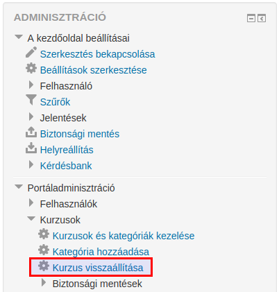

:icons: font
:experimental: enable
:toc: right
:toclevels: 3

<<<

= Kurzus helyreállítása

Egy kurzusról készült biztonsági mentést (.mbz) helyreállíthatunk minden olyan létező kurzushoz, amelyhez engedélyünk van. A helyreállítási folyamat során lehetőségünk van megadni, hogy új kurzusként hozzuk létre, vagy egy már létező kurzusba állítsuk helyre lementett kurzusunkat.

[NOTE]
--
Ha a kurzust felhasználói adatokkal (pl. fórumbejegyzések) állítjuk helyre, ügyeljünk a kurzus kezdődátumának beállítására, mivel az összes adat ugyanabban az időkeretben, de az új kezdési dátumtól fog megjelenni. Vagyis, ha egy kurzus eredetileg 2016-ban kezdődött és 2017-ben írtak bele a felhasználók, és 2017-es kezdődátummal állítjuk vissza a kurzust, a hozzászólásaik 2018-as dátummal jelennek meg.
--

[NOTE]
--
Ha az új kurzus kevesebb szakaszból áll, mint a helyreállítandó kurzus, a helyreállítandó kurzus szakaszai "árva tevékenységekként" jelennek meg. Ahhoz, hogy ezek a tevékenységek is megjelenjenek, növelnünk kell a szakaszok számát az új kurzusban.
--

Egy kurzus helyreállítását többféleképpen kezdeményezhetjük:

* kiindulási pontunk lehet a menu:Adminisztráció[Portáladminisztráció > Kurzusok > Kurzus visszaállítása] menüpont:

::

<<<

* a kiválasztott kategória szintjén - menu:Adminisztráció[Kategória > (Kategória neve)]:

::

* a kiválasztott kurzus szintjén - menu:Adminisztráció[Kurzus kezelése > Helyreállítás]:

::

<<<

A kurzus visszaállítása vagy helyreállítás oldalon feltölthetünk/kiválaszthatunk egy elmentett biztonsági mentés állományt az btn:[Állományválasztó megnyitása] gomb segítségével,

::

vagy választhatunk korábbi mentéseink közül:

::

**A kurzus biztonsági mentésének területe** részen találjuk azokat a mentéseket, mely mentések alapbeállításokkal készült biztonsági mentések. A **Saját biztonsági mentések területe** alatt találjuk azokat a biztonsági mentéseket, melyek névtelen felhasználói adatokkal készültek.

A btn:[Biztonsági mentés állományainak kezelése] gomb segítségével újabb biztonsági mentéseket tölthetünk fel, illetve törölhetünk a biztonsági mentések területein.

A btn:[Helyreállítás] gombra vagy link:[Helyreállítás] linkre kattintással kezdeményezhetjük a kiválasztott állomány helyreállítását. Első lépésben megjelennek a biztonsági mentés paraméterei: tájékozódhatunk a biztonsági mentés típusáról, beállításairól, a kurzus adatairól és a kurzusfejezetekről. A btn:[Folytatás] gombra kattintva választanunk kell, hogy új kurzusként vagy egy létező kurzusba állítjuk vissza elmentett kurzusunkat. Létező kurzus esetén választhatunk, hogy egyesítjük a mentett kurzust a létező kurzussal, vagy előbb töröljük a létező kurzus tartalmát.

Amint eldöntöttük, melyik utat járjuk, kattintsunk a választott módhoz tartozó btn:[Folytatás] gombra, és kiválaszthatjuk, a biztonsági mentésből milyen összetevőket szeretnénk visszaállítani. A btn:[Következő] gombra kattintásra megjelenő oldalon **Kurzusbeállítások** részben megadhatjuk, milyen névvel, rövid névvel állítsuk vissza mentett kurzusunkat, beállíthatjuk a kurzus kezdési időpontját, és kiválaszthatjuk, mely tevékenységek imprtálódjanak.

Amikor beállítottuk a paramétereket és kiválasztottuk a számunkra szükséges tulajdonságokat, a btn:[Következő] gombra kattintással ellenőrizhetjük választásainkat, és ha valami nem egyezik elképzeléseinkkel, visszatérhetünk a Kurzusbeállítások oldalra az btn:[Előző] gombra kattintásával.

A btn:[Visszaállítás végrehajtása] gomb elindítja a visszaállítási folyamatot, és ha a folyamat rendben lezajlott, a btn:[Folytatás] gomb a visszaállított kurzusra irányít minket.
