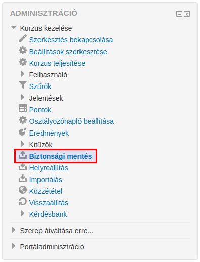
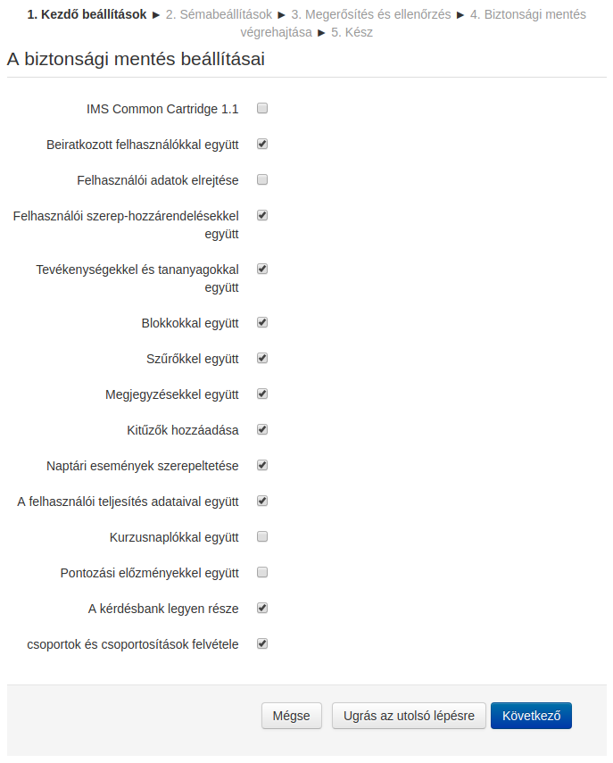
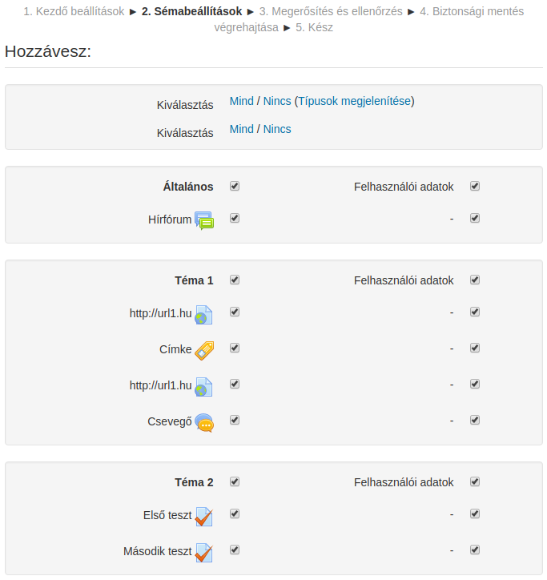
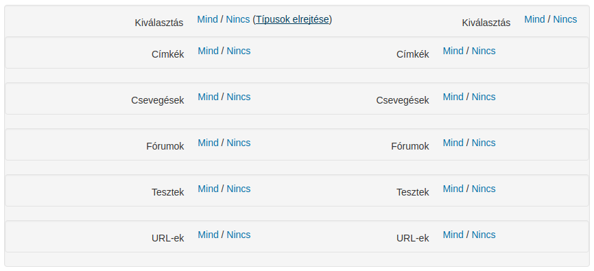

:icons: font
:experimental: enable
:toc: right
:toclevels: 3

= Kurzus mentése

A kurzus biztonsági mentése funkció segítségével a kurzus egy részéről vagy egészéről készíthetünk másolatot. A portál rendszergazdája jellemzően az egész webhely kurzusainak automatizált mentését ütemezi, míg a szerkesztő jogosultsággal rendelkező tanár biztonsági másolatot készíthet vagy tölthet le meglévő biztonsági másolatot, mely másolat más Moodle környezetben is használható.

A kurzus biztonsági mentését például a menu:Adminisztráció[Kurzus kezelése > Biztonsági mentés] menüpont alól kezdeményezhetjük.

<<<

* a Kezdő beállítások lépésnél meghatározzuk, a kurzus mely részeiről, összetevőiről készüljön mentés.
::

[TIP]
--
Amennyiben a biztonsági mentés alapbeállításait elfogadjuk, az btn:[Ugrás az utolsó lépésre] gombra kattintva azonnal elkészül a biztonsági mentés.
--

<<<

* a Sémabeállítások részben kiválasztjuk, hogy mely tevékenységek kerüljenek bele a biztonsági másolatba.
::

[NOTE]
--
A link:[Típusok megjelenítése] linkre kattintva tevékenységtípusok szerint is kijelölhetjük azon tevékenységeket, melyekről biztonsági mentést akarunk készíteni.

--

<<<

* a Megerősítés és ellenőrzés lépésben ellenőrizhetjük beállításainkat. Lehetőségünk van visszalépni, ha szeretnénk módosítani beállításainkon. Amennyiben mindent megfelelőnek találunk, a btn:[Biztonsági mentés] gombra kattintva elkészül a biztonsági mentés.

* a btn:[Folytatás] gombra kattintva látjuk a kurzushoz tartozó, létező biztonsági mentéseinket, melyeket letölthetünk.

[NOTE]
--
Ha a **Kezdő beállítások** lépésnél a **Felhasználói adatok elrejtése** opciót választottuk, a biztonsági másolat a **Saját biztonsági mentések területe** részbe kerül, egyébként **A kurzus biztonsági mentésének területe** alatt jelenik meg.

Alapértelmezésben a biztonsági másolat nevének utolsó két karaktere utalhat a mentés egyes beállításaira. Például:

* a -nu.mbz ('no users') végződés utalhat arra, hogy a felhasználókat nem mentettük el,
* míg az -an.mbz ('anonymized names') végződés arra utal, hogy a felhasználói adatokat elrejtve készítettünk biztonsági másolatot.
--
