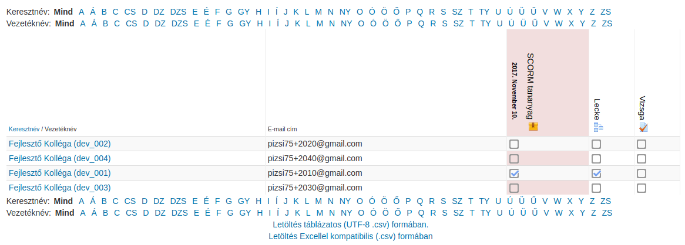

:icons: font
:experimental: enable
:toc: right
:toclevels: 3

= Kurzus

A kurzus a Moodle-ben az alap *oktatási egység*. Felfoghatjuk úgy is - és sok esetben így is kezeljük -, mint egy tantárgy/tréning virtuális leképzése. A kurzus összetevői:

* szereplők (tanár, tanuló)
* képzési anyagok
** tananyagok (szövegek, képek, filmek, animációk stb.)
** tevékenységek (feladatok, tesztek, projektek, viták stb.)
* "játékszabályok" (követelmények, határidők, értékelések stb.)

<<<

== Kurzus létrehozása, testreszabása

=== Kurzuskategóriák

A kurzusokat érdemes kategóriákba szervezni. Ez megkönnyíti az átláthatóságot, amikor már sok kurzus található a Moodle-ban. Ilyen kategóriákat létrehozni a menu:Portáladminisztráció[Kurzusok > Kurzusok és kategóriák kezelése] pontban tudunk.

.Kurzuskategóriák

* Bal oldalon a *Kurzuskategóriák* alatt láthatjuk a kategóriák hierarchiáját. Itt tudunk új kategóriát létrehozni, illetve az egyes kategóriák mellett található ikonok segítségével tudjuk mozgatni őket, illetve a fogaskerék ikonra kattintva tudjuk szerkeszteni. Itt ki tudunk választani több kategóriát és a *Kiválasztott kategóriák áthelyezése ide* funkció segítségével át tudjuk mozgatni másik szülő alá.
* Ha rákattintunk egy kategóriára, akkor jobbra megjelenik az adott kategória kurzuslistája. Itt tudunk létrehozni kurzust közvetlenül a kategória alatt, illetve a kategória kurzusait rendezhetjük.
* Rákattintva egy kurzus nevére, a kurzusról kapunk áttekintő információt, illetve elérjük a hozzá kapcsolódó alapvető funkciókat (Szerkesztés, Törlés, Beiratkozott felhasználók stb.)

NOTE: A fenti panelek lehetséges, hogy nem egymás mellett, hanem egymás alatt jelennek meg, ez függ a képernyőfelbontás nagyságától.

<<<

=== Kurzus létrehozása

A szükséges kurzuskategóriák létrehozása után hozzunk létre új kurzust az *Új kurzus hozzáadása* linkre kattintással. A megjelenő űrlapon adhatjuk meg a kurzus általános paramétereit.

WARNING: A csillaggal jelölt mezőket mindig ki kell tölteni!

==== Általános

Itt adthatjuk meg a kurzus rövid és hosszú nevét, illetve azt, hogy mikortól legyen elérhető.

.Kurzusparaméterek - Általános rész
image::./pics/kurzus/kurzus-parameterek-altalanos.png[Kurzusparaméterek - Általános rész, align="center"]

NOTE: A kurzus rövid neve olyan helyeken jelenik meg, ahol kevés a hely (például a navigációban), ezért ez is a tanuló által értelmezhető cím legyen.

A *Kurzuskategória* opció segítségével ezen a felületen is módosíthatjuk, hogy mely kategória alatt legyen a kurzusunk.

A *Látható* tulajdonság *Elrejtés*-re állítása azt eredményezi, hogy a tanulók nem látják a felületen, illetve nem is tudják keresni a kurzust, még akkor sem, ha beiratkoztatásra kerültek rá.

TIP: Amíg a kurzusunk összeállítását végezzük, állítsuk *Elrejtés*-re.

<<<

*A kurzus kezdésének dátuma* mezőnek csak heti forma (lásd később) esetén van jelentősége, ha nem heti formában vagyunk és beállítunk egy jövőbeni dátumot, a tanulók ugyanúgy el tudják érni a kurzust.

==== Leírás

A *Kurzusösszegzés* és a *Kurzusleíró állományok*-nál megadott szöveg és képek a kurzuslistákban fognak megjelenni. Ide egy rövid leírást és egy kis képet érdemes feltölteni.

==== Kurzusforma

Itt adhatjuk meg, hogy a kurzusunk milyen felépítésű legyen.

* Az egyik fő lehetőség, hogy a kurzusunkat témák szerint szakaszokra bontjuk és ezekbe töltjük fel a tartalmainkat, ez a *Témaforma*.
* A másik lehetőség a *Heti forma*, amikor a kurzus egyes részeit hetente tesszük elérhetővé. Ebben az esetben meg kell adni a kurzus kezdő időpontját, ettől az időponttól lesz heti bontásban beosztva a tartalom.
* Van még a *Fórumforma*, ami tulajdonképpen egy fórumot tartalmazó kurzus, illetve van az *Egy tevékenységes forma*, ebbe csak egy tevékenységet tudunk feltölteni.

TIP: A *Heti formát* inkább egyetemi környezetben szokták használni, általában a *Témaformát* javasoljuk.

image::./pics/kurzus/kurzus-parameterek-kurzusforma.png[Kurzusparaméterek - Kurzusforma, align="center"]

TIP: A *Szekciók számát* érdemes korlátozni, amennyiben például csak egy tananyag szekciót és egy vizsga szekciót szeretnénk, vegyük 2-re az értéket.

A *Rejtett részek* megmondja, hogy ha kézzel elrejtünk egy szekciót, az hogy jelenjen meg, a *Kurzus elrendezése* opcióval azt tudjuk szabályozni, hogy az egyes szekciók egy oldalon jelenjenek meg vagy külön oldanként.

==== Megjelenés

Itt elő tudjuk írni, hogy egy kurzus megnyitása esetén a rendszer váltsa-e át a felület nyelvét egy meghatározottra, illetve szabályozni tudjuk, hogy a tanulók a saját haladásukról milyen riportokat láthassanak.

==== Állományok és feltöltések

Az állományok és feltöltések alatt megadhatjuk, hogy a tanárok maximum mekkora állományt tölthetnek fel.

NOTE: Amennyiben az itt megjelenő maximális értéket növelni szeretnénk, szerverbeállítás szükséges: link:https://docs.moodle.org/en/File_upload_size[https://docs.moodle.org/en/File_upload_size]

<<<

==== Teljesítés nyomonkövetése

Bekapcsolt állapotában a kurzus elvégzetté válik, ha a tanuló teljesítette a kurzusban előírt tevékenységeket. Erre később külön fejezetben kitérünk.

WARNING: Amennyiben nem elérhető ez az opció, a menu:Portáladminisztráció[További jellemzők] alatt kapcsoljuk be.

==== Csoportok

Ez inkább egyetemi környezetben használt funkció. Lehetőség van kurzuson belül külön csoportokat alakítani és a csoportokhoz külön tanárt rendelni. Így a beállításoktól függően a csoport tanárjai csak a csoport hallgatóinak eredményét látják.

image::./pics/kurzus/kurzus-parameterek-csoportok.png[Kurzuspareméterek - Csoportok, align="center"]

==== Szerep átnevezése

A kurzus alatt egyedi neveket adhatunk a szerepeknek, például a _Tanárt_ hívhatjuk _csoportvezetőnek_.

<<<

==== Címke

Rendelhetünk címkéket a kurzushoz, melyek alapján ezután a felhasználók tudnak keresni például a menu:Portáloldalak[Címkék] menüpont alól vagy a tagfelhő blokkból.

<<<

== Kurzus tartalmának kialakítása

Miután létrehoztuk a kurzusunkat és megadtuk az általános paramétereit, felvehetjük hozzá a tartalmakat. Ehhez először nyissuk meg a kurzust, majd kapcsoljuk be a szerkesztési módot.

.Szerkesztés bekapcsolása
image::./pics/kurzus/kurzus-szerkesztes-bekapcsolas.png[Szerkesztés bekapcsolása, align="center"]

WARNING: A kurzus *Beállítások szerkesztése* oldaláról legegyszerűbben a _breadcrumb_ segítségével navigálhatunk vissza a kurzus főoldalára.

<<<

Miután átváltottuk szerkesztési módra a kurzust, a következőt látjuk.

.Kurzusszerkesztés bekapcsolva
image::./pics/kurzus/kurzus-szerkesztes-bekapcsolva.png[Kurzusszerkesztés, align="center"]

Itt módosíthatjuk a témák sorrendjét, átnevezhetjük őket, illetve a témák alá felvehetünk új tevékenységeket és tananyagokat.

<<<

=== Tananyag / tevékenység hozzáadása

==== Áttekintés

A következőkben röviden áttekintjük a Moodle tananyag és tevékenység típusait.

===== Tananyag

A Moodle rendszerben a *tananyag* típusú tartalmak olyan elemek, amelyeket a kurzus diákjai egyszerűen megtekinthetnek vagy letölthetnek; azaz alapvetően *passzív*, interakciót nélkülöző elemek. Ilyen *statikus tartalmakat* adhatunk a Tevékenység vagy tananyag beszúrása linkre kattintva, majd a listából a következő típusú tartalmakat választhatjuk ki.

.Tananyagok

::
Címke:::
Az egyes témakörök tagolását segíti, rövid összefoglalókat, utasításokat helyezhetünk el vele. A címkék némileg eltérnek az egyéb tananyagforrásoktól. Ezek ugyanis olyan szövegek és képek, amelyek ténylegesen közvetlenül be vannak ágyazva a kurzusoldal többi ugrópontja közé.
IMS tartalomcsomag::: Ezzel a forrástípussal az IMS tartalomcsomagolási specifikációknak megfelelő tartalom jeleníthető meg.

Könyv:::
Szöveget és médiát tartalmazó oldalakat fejezetekre bontva, strukturálva jeleníti meg.

Mappa:::
A Mappa segítségével fel tudunk tölteni egy .zip állományt, majd kicsomagolni. Ezután a tanuló böngészhet a .zip által tartalmazott könyvtárak és fájlok között.

Oldal::: Egyszerű szöveges dokumentum hozzáadására szolgál, az oldalon megjelenhet szöveg, kép, hang, videó, webes ugrópontok és beágyazott kód, például a Google Maps.

Tananyag::: Segítségével egy vagy több fájlból álló tartalmat tölthetünk fel. Ilyen lehet például egy PowerPoint prezentáció vagy egy képeket tartalmazó HTML oldal.

URL::: Egy URL cím hozzáadása.

NOTE: A már feltöltött tartalmakat a fogaskerék ikonra kattintva *szerkeszthetjük*, és a piros
ikszel *törölhetjük* a szerkesztés bekapcsolása után.

===== Tevékenység

A *tevékenység* típusú tartalmak esetében a kurzus tanulóinak bizonyos
*aktivitást* kell kifejteniük; használatuk esetén valamilyen interakció jön létre a tanulásban résztvevő személyek (tanár, tanuló), vagy a rendszer és az adott tartalomelem között.

.Tevékenységek

<<<

Tevékenység alapú tartalmak:

::
Adatbázis:::
Az adatbázis-tevékenységi modullal a résztvevők közösen építhetnek egy adatbázist, melyben meghatározott séma szerinti rekordokat vehetnek fel. Felvehetnek akár képeket, állományokat is.

Csevegés:::
Egy web alapú csevegést lehetővé tevő alkalmazás. Használata külső alkalmazás telepítését nem igényli. Az oktató beállíthatja a csevegés rendszerességét, időpontját, melyről a résztvevőkértesítést kapnak. A Moodle eltárolja az „elhangzottakat”, így a csevegésből kimaradók is felzárkózhatnak.

Feladat:::
Ezt a tevékenységtípust egyetemen szokták leginkább használni beadandókhoz. A tanulónak vagy szöveget kell írnia vagy a feladat megoldását fájlban töltheti fel, melyet a tanár értékelni tud.

Felmérés:::
A felmérő modullal szabványos kérdőívek segítségével gyűjthet a tanár adatokat az osztályáról és reagálhat saját oktatására. Az egyes kérdéseket itt nem lehet szerkeszteni, csak a beépített kérdőíveket használhatjuk.

Fogalomtár:::
Segítségével kereshető fogalomtárat alakíthatunk ki, amely tartozhat csak kurzushoz, de lehet globális is. Ezt a fogalomtárat adott esetben a tanulóink is szerkeszteni tudják majd.

Fórum:::
Egymással párhuzamosan több fórumot is létrehozhatunk egy tanfolyamon belül. A fórumok tetszőleges számú témát, és ahhoz hozzászólásokat tartalmazhatnak.

Külső eszköz:::
A Moodle felhasználói más portálokon lévő tananyagokkal és tevékenységekkel léphetnek kapcsolatba. A kapcsolat LTI (Learning Tools Interoperability) szabványon keresztül folyhat.

Lecke:::
A lecke tartalmak érdekes és rugalmas módon való közvetítésére használható. Több oldalból tevődik össze. Minden oldal általában egy kérdéssel és hozzá egy sor lehetséges válasszal zárul. A résztvevő a válaszadási lehetőségektől függően vagy továbblép a következő oldalra, vagy visszajut az előzőre. A leckén való végighaladás a közreadandó anyag struktúrájától
függően lehet egyszerű és bonyolult.

Műhelymunka:::
A workshop segítségével olyan projekt alapú oktatási feladatok támogathatók, ahol a cél különböző fájlok létrehozása. Az oktató előre definiálhatja a munkafázisokat, az elkészült
munkákat a résztvevők feltölthetik értékelésre, illetve egymás produktumait is értékelhetik.

SCORM-csomag:::
SCORM 1.2 (vagy AICC) szabványos tartalmakat tölthetünk fel, melyek haladási információkat / pontszámot küldenek a Moodle-nak.

Teszt:::
A Moodle legszélesebb körben használt tevékenységtípusa, teszteket, vizsgákat állíthatunk össze a segítségével.

Válaszlehetőség:::
Több válaszlehetőséget tartalmazó kérdés, mely lehet anonim is. Például a tanár összegyűjtheti, hogy a tanulók hány százaléka használ Linux operációs rendszert.

Wiki:::
A modul lehetővé teszi, hogy a kurzus résztvevői közösen vagy egyénileg (saját maguknak) készítsenek Wikipédia jellegű tudásbázist.

==== Tananyagnál / tevékenységnél elérhető általános beállítási lehetőségek

Amikor létrehozunk egy tevékenységet / tananyagot, van néhány szekció, ami közös ezekben. A következőkben ezeket foglaljuk össze.

::
Általános:::

image:./pics/kurzus/tevekenyseg_parameterek_altalanos.png[Tevékenység - Általános, align="center"]
+
Itt adhatjuk meg a tananyag nevét és leírását. Amennyiben kijelöljük a *Leírás megjelenítése a kurzusoldalon* opciót, akkor a kurzusoldalon a tananyag címe alatt megjelenik a leírás is.

Szokásos modulbeállítások:::

+
Itt állíthatjuk be, hogy a tanulók láthatják-e a tananyagot / tevékenységet. Akkor érdemes elrejteni, amikor egy már elérhető kurzushoz adunk hozzá új tartalmat.
+
Továbbá itt rendelhetünk technikai azonosítószámot a tartalomhoz.

Elérhetőség korlátozása:::

Beállíthatjuk, hogy bizonyos tevékenység elvégzéséhez kössük egy másik tevékenység megkezdésének lehetőségét. Például csak akkor tudjon a tréningre jelentkezni, ha sikeres a
volt a tesztje. A tartalmat látja a tanuló, de nem tudja elindítani, le van szürkítve addig, amíg a feltételek nem teljesülnek.
+

Tevékenység végrehajtása::::
Ezzel azt tudjuk szabályozni, hogy a tananyag akkor legyen csak elérhető ha egy másik tevékenységet már teljesített a tanuló. Ehhez szükséges a teljesítés nyomonkövetés (lásd később).

Dátum::::
A Dátum '-tól' és az '-ig' dátumokkal adhatjuk meg, hogy az adott tananyagot vagy tevékenység mikortól vagy meddig lehet megtekinteni.

Osztályzathoz kapcsolódó feltétel::::
Egy másik tevékenységben szerzett pontszámhoz tudjuk kötni az elérhetőséget. Például akkor indíthatja el csak a tesztet a felhasználó, ha a tananyagot 80%-ra teljesítette.

Felhasználói profilhoz kapcsolódó feltétel::::
Valamely felhasználói profilmező teljesülő feltételt állíthatsz be.

Korlátozáskészlet::::
Egy korlátozás csoportot tudunk felvenni, melyek között vagy kapcsolat is lehet.

A következő képen beállított előfeltételekre láthatunk példát:

.Tevékenység - Elérhetőség korlátozása példa

[[tevekenyseg-teljesitese]]
===== Tevékenység teljesítése

A tevékenység teljesítésénél azt tudjuk megadni, hogy mikor vesszük teljesítettnek a tanuló tevékenységét a tartalomban. Ekkor a tanuló is látja a tartalom elvégzési állapotát, illetve ezt fel tudjuk használni majd kurzusszintű teljesítéshez.

WARNING: Ez az opció csak akkor elérhető, ha a kurzusnál bekapcsoltuk a teljesítés nyomonkövetését (menu:Kurzus kezelése[Beállítások szerkesztése > Teljesítés nyomon követése]).

A teljesítés típusai a következők:

* *sikeres*: zöld pipa
* *sikertelen*: piros pipa
* *teljesített*: kék pipa (ilyenkor csak azt tudjuk, hogy befejezte)

.Tevékenység - Tevékenység teljesítése pipák

Nem minden tevékenység tudja az állapotot sikeresre / sikertelenre állítani, van ami csak egyszerűen teljesítettre állítja magát (kék pipa).

Azt, hogy mit állíthatunk be, tartalomtípustól függ, mert nem biztos, hogy minden tartalom küld pontszámot (osztályzatot). De vannak opciók, melyeket általában minden tevékenységnél meg lehet adni.

A tanulók ezt a tevékenységet kézzel mint teljesítettet jelölhetik meg::: Ha ezt választjuk a *Teljesítés nyomonkövetése* mellett, akkor a tanulónak kézzel kell bepipálnia, hogy ő megnézte az adott tananyagot. Ilyenkor ez a bizalomra épül.
A tevékenységet teljesítettként jelöli meg, ha a feltételek teljesültek::: Ha ezt választjuk, a tevékenységtípustól függő opciókkal adhatjuk meg a teljesítéshez szükséges feltételeket.

<<<

A következő képen a *Lecke* tevékenység beállításait láthatjuk:

.Tevékenység - Tevékenység teljesítése
image::./pics/kurzus/tevekenyseg_parameterek_tevekenyseg_teljesitese.png[Tevékenység - Tevékenység teljesítése, align="center"]

Néhány opció:

A tanulónak a tevékenység teljesítéséhez a tevékenységet meg kell tekinteni::: Ekkor csak azt várjuk el, hogy a tanuló megnyissa a tananyagot, például amikor letölt egy PDF-et, de nem tudjuk, hogy el is olvasta-e.
A tanulónak a tevékenység teljesítéséhez osztályzatot kell kapnia::: Olyan tevékenységek esetén érhető el, melyeknél valamilyen pontszámot szerez a felhasználó (például teszt). Ezzel csak azt mondjuk meg, hogy pontot kell, hogy szerezzen, de nem írjuk elő, hogy mennyit (például a teszteknél elő lehet írni).
Teljesítés előírt időpontja::: Egy dátum, mely megadható, de a tanulók nem látják. Ez csak egy infó, ami a *Tevékenység végrehajtása* kurzusriportban jelenik meg.

<<<

== Fontosabb tananyag / tevékenység típusok

A következőkben részletesebben ismertetjük a legszélesebb körben használt tevékenységtípusokat és beállítási lehetőségeiket:

* <<tananyag-tananyag,Tananyag>>
* <<lecke-tevekenyseg,Lecke>>
* <<scorm-tevekenyseg,SCORM>>
* <<teszt-tevekenyseg,Teszt>>

include::tananyag-tananyag.adoc[leveloffset=+2]

<<<

include::lecke-tevekenyseg.adoc[leveloffset=+2]

<<<

include::tesztek.adoc[leveloffset=+2]

<<<

include::scorm-tananyag.adoc[leveloffset=+2]

<<<

[[kurzus-osztalyozonaplo]]
== Osztályozónapló

Az osztályozónapló segítségével állíthatjuk össze, hogy a kurzus tevékenységei által küldött pontszámok hogyan jelenjenek meg a pontozói jelentésben és hogyan számítódjon a kurzus összpontszáma.

[[osztalyozonaplo-beallitasa]]
=== Beállítás

A beállításokat egy kurzus megnyitása után a menu:Kurzus kezelése[Osztályozónapló beállítása] alatt érthetjük el.

NOTE: Ilyenkor a bal oldali menüben átkerülünk egy *Osztályozás kezelése* menücsoportba, ahol a kurzus pontozással kapcsolatos további beállításait és lekérdezéseit érhetjük el.

.Osztályozónapló beállítása

Az egyes elemek mellett található btn:[Szerkesztés] gombra kattintva tudjuk módosítani a súlyozást, szorzót adhatunk meg stb.

A *Kurzus összegezve* melletti btn:[Szerkesztés] gombra kattintva egyedi kalkulációt adhatunk meg, ami alapján a kurzus összpontszáma számítódni fog.

NOTE: Ezek a lehetőségek egyetemi környezetben használhatók jól, ahol a félév végi jegyekhez szükséges összpontszámba az egyes tevékenységek különböző súllyal vagy szorzóval számítanak be.

<<<

.Néhány szó a skáláról
Vannak olyan tevékenységtípusok, melyeknél be lehet állítani, hogy ne pontszámot küldjenek, hanem egy skálán megadott értékelést. Ilyen skála lehet például: "nem felelt meg", "megfelelt", "tökéletes". Ilyenkor ez jelenik meg a pontozói jelentésben.

[[osztalyozonaplo-eredmeny]]
.Néhány szó az eredményről
Az osztályozónaplóba lehetőség van *Eredményelemet* felvenni, mely egy skálán megadott értékeléssel jelzi a tanuló teljesítményét a kurzuson. Ennek értéke is kalkulációval számolható.

[[osztalyozonaplo-lekerdezesek]]
=== Lekérdezések

==== Pontozói jelentés

Miután megnyitottunk egy kurzust, a *Pontozói jelentést* a menu:Kurzus kezelése[Pontok] menüpont segítségével érhetjük el. Ugyanezt a lekérdezést érjük el a menu:Osztályozás kezelése[Pontozói jelentés] alatt.

A jelentésben láthatjuk a kurzus összes tanulója által a kurzus egyes tevékenységeiben és összesen elért pontszámát.

NOTE: A jelentés az <<osztalyozonaplo-beallitasa,Osztályozónapló beállítása>> felületen megadott struktúrában és számítási szabályok szerint jeleníti meg a pontokat.

.Osztályozónapló - Pontozói jelentés
image::./pics/kurzus/osztalyozonaplo_pontozoi_jelentes.png[Osztályozónapló - Pontozói jelentés, align="center"]

A tevékenységek címe és a tanulók neve mellett található ceruza segítségével átkerülünk az <<osztalyozonaplo-egyszeres-nezet,Egyszeres nézet>> felületre, ahol a tanuló vagy a tevékenység összes tanulójának pontját felül tudjuk írni.

TIP: Amennyiben százalékosan is meg szeretnénk jeleníteni a pontszámokat, ezt megtehetjük az menu:Osztályozás kezelése[Beállítás > Kurzuspontok beállítása] felületen az *Osztályozási tétel beállításai* alatt. Ez csak az adott kurzusra vonatkozólag adja meg a beállítást, az btn:[Alapbeállítások módosítása] linkre kattintva módosíthatjuk a portálszintű beállítást.

A pontozói jelentés Excel exportjához válasszuk az menu:Osztályozás kezelése[Exportálás > Excel táblázat] menüpontot. Itt szintén be tudjuk állítani, hogy százalékos eredményt is akarunk-e látni, illetve megadhatjuk, hogy mely tevékenységek kerüljenek be a táblázatba.

==== Előzménynapló

Ebben a jelentésben a kurzus tevékenységeiben történt pontszerzéseket listázhatjuk, illetve exportálhatjuk.

Lehetőségünk van időintervallumra, felhasználóra szűrni, illetve láthatjuk a felülírt pontszámokat is.

.Osztályozónapló - Előzménynapló

==== Eredményjelentés

A kurzusban használt <<osztalyozonaplo-eredmeny,Eredmények>> kurzusátlagairól ad információt.

==== Áttekintő jelentés

Egy adott felhasználó összes kurzusában elért pontszámát láthatjuk.

NOTE: Ezt a felületet látja a tanuló is amikor a fejlécben lévő lenyíló menüben kiválasztja a *Pontok* menüpontot.

.Osztályozónapló - Áttekintő jelentés

[[osztalyozonaplo-egyszeres-nezet]]
==== Egyszeres nézet

Egy tevékenység összes tanulójának vagy egy tanuló összes tevékenységének pontszámait tudjuk listázni és felülírni a felületen.

.Osztályozónapló - Egyszeres nézet
image::./pics/kurzus/osztalyozonaplo_egyszeres_nezet.png[Osztályozónapló - Egyszeres nézet, align="center"]

==== Felhasználói jelentés

Egy adott felhasználó a kurzus tevékenységeiben szerzett pontjait tudjuk megtekinteni.

NOTE: Ezt a felületet látja a tanuló is amikor a fejlécben lévő lenyíló menüben kiválasztja a *Pontok* menüpontot, majd rákattint egy kurzusra.

.Osztályozónapló - Felhasználói nézet
image::./pics/kurzus/osztalyozonaplo_felhasznaloi_jelentes.png[Osztályozónapló - Felhasználói nézet, align="center"]

== Kurzusteljesítés nyomonkövetése

Ahogy a <<tevekenyseg-teljesitese,tevékenységeknél be tudtuk állítani>>, hogy milyen feltételek teljesülésekor tekinthetjük a tartalmat elvégzettnek, ugyanezt megtehetjük a kurzusoknál is.

WARNING: Ez az opció csak akkor elérhető, ha a kurzusnál bekapcsoltuk a teljesítés nyomonkövetését (menu:Kurzus kezelése[Beállítások szerkesztése > Teljesítés nyomon követése]).

WARNING: A kurzusteljesítés számítása a háttérben történik, ami azt jelenti, hogy miután teljesült a feltétel - ami alapján a kurzust teljesítettre kell állítani-, kell várni valamennyit, amíg teljesített lesz a kurzus.

<<<

=== Beállítás

Miután kiválasztottunk egy kurzust szerkesztésre, a menu:Kurzus kezelése[Kurzus teljesítése] alatt tudjuk megadni a teljesítéshez szükséges feltételeket.

.Kurzusteljesítés felület
image::./pics/kurzus/kurzus_teljesites_felulet.png[Kurzusteljesítés felület, align="center"]

==== Általános

Az *Általános* alatt tudjuk megadni, hogy a lentebb megadott feltételeknek együtt kell teljesülniük vagy bármelyik teljesülhet közülük.

image::./pics/kurzus/kurzus_teljesites_altalanos.png[Kurzusteljesítés - Általános, align="center"]

==== Feltétel: Teljesített tevékenységek

Itt tudjuk megadni, hogy a kurzusban szereplő tevékenységek teljesítettségétől függően állítsuk teljesítettre a kurzusunkat.

WARNING: Itt csak azok a tevékenységek fognak megjelenni, melyeknél beállítottuk a teljesítettség nyomonkövetését (<<tevekenyseg-teljesitese,Tevékenység teljesítése>>)

image::./pics/kurzus/kurzus_teljesites_teljesitett_tevekenysegek.png[Kurzusteljesítés - Teljesített tevékenységek, align="center"]

Itt szintén meg tudjuk mondani, hogy minden tevékenységet teljesítenie kell a tanulónak vagy elegendő bármelyiket közülük.

==== Feltétel: Más kurzusok teljesítése

Itt ki tudjuk választani azokat a kurzusokat, melyek teljesítése előfeltétele a mi kurzusunknak.

[[kurzus-teljesites-feltetel-datum]]
==== Feltétel: Dátum

Ez akkor használható, amennyiben a kurzusról a tanulóink bármikor lejelentkezhetnek és a kurzusunk teljesítettségét ahhoz szeretnénk kötni, hogy egy megadott időpontig nem jelentkeztek le.

==== Feltétel: Beiratkozás időtartama

Ugyanaz, mint a <<kurzus-teljesites-feltetel-datum, Dátum>>, de itt nem konkrét dátumhoz kötjük, hanem a kurzus tagság hosszához.

==== Feltétel: Kiiratkozás

Akkor lesz teljesített a kurzus, ha a tanuló kiiratkozik róla.

==== Feltétel: Kurzusosztályzat

A tevékenységek által szolgáltatott pontszámokból számítódik a kurzus pontszáma (lásd: <<kurzus-osztalyozonaplo, Osztályozónapló>>). Itt tudjuk megadni, hogy hány ponttól teljesített a kurzusunk.

image::./pics/kurzus/kurzus_teljesites_kurzusosztalyzat.png[Kurzusteljesítés - Kurzusosztályzat, align="center"]

==== Feltétel: Saját teljesítés kézzel

Ha ezt bekapcsoljuk, akkor a kurzust a felhasználó kézzel teljesítettnek jelölheti.

NOTE: Ahhoz, hogy ezt meg tudja tenni, adjuk hozzá a kurzusoldalhoz az *Önálló teljesítés* blokkot.

==== Feltétel: Kézzel teljesítette más

Itt adhatjuk meg, hogy milyen szerepkörű felhasználók tudják kézzel teljesítetté jelölni a kurzust egy-egy tanulóhoz.

NOTE: Ha több szerepkört adunk meg és köztük *és* (*Minden kiválasztott szerep osztályozzon, ha a feltétel teljesül*) kapcsolatot adunk meg, akkor a kurzusteljesítést minden kiválasztott szerepkörnek jóvá kell hagynia.

Miután beállítottuk, a beállított szerepkörű felhasználók a menu:Kurzus kezelése[Jelentések > Kurzusteljesítés] oldalon tudják a kurzust készre állítani.

<<<

[[kurzus-teljesites-lekerdezesek]]
=== Lekérdezések

==== Kurzusteljesítés

A menu:Kurzus kezelése[Jelentések > Kurzusteljesítés] alatt láthatjuk, hogy a kurzus tanulói teljesítették-e a kurzus tevékenységeit, illetve a teljesítési feltételeknek megfelelően a kurzust. Továbbá az igazgatók, illetve a tanárok -- amennyiben a *Feltétel: Kézzel teljesítette más* be van állítva -- itt tudják jóváhagyni a teljesítést.

.Kurzusteljesítés

<<<

== Jelentések

A legfontosabb kurzushoz kapcsolódó jelentéstípusokat az <<osztalyozonaplo-lekerdezesek,Osztályozónapló lekérdezések>> és <<kurzus-teljesites-lekerdezesek,Kurzusteljesítés lekérdezések>> fejezetben láthattuk. Ezen kívül van még néhány jelentés a kurzuson belül, ezeket néhány szóban bemutatjuk.

=== Naplók

Részletes, rendszerszintű műveletlistát kérhetünk le, illetve szűrhetünk. Itt látunk minden olyan műveletet, amit a tanulók a portálon végeztek, külön eseményként láthatjuk például a kurzuslieratkozást, vizsgapróbálkozásokat stb.

.Jelentések - Naplók
image::./pics/kurzus/kurzus_jelentesek_naplok.png[Jelentések - Naplók, align="center"]

=== Élő naplózások

Ugyanaz, mint a *Naplók*, csak folyamatos frissítéssel.

=== Kurzustevékenység

Összesítve láthatjuk, hogy melyik tevékenységet hányszor nézték meg a kurzusban.

=== Kurzusrészvétel

Meg tudjuk nézni, hogy mely tevékenységeket mely tanuló hányszor tekintette meg, illetve üzenetet is tudunk küldeni nekik.

<<<

=== Tevékenység végrehajtása

Itt láthatjuk, hogy mely tanuló mely tevékenységet teljesítette. Pirossal van megjelölve az a tevékenység, melyhez a megadott *Teljesítés előírt időpontja* már elérkezett.

.Jelentések - Tevékenység végrehajtása

=== Statisztika

Napokra és szerepkörökre lebontva láthatjuk, hogy hányan tekintették meg a kurzust.

