:icons: font
:experimental: enable
:toc: right
:doctype: book

[[lecke-tevekenyseg]]
= Lecke

Lecke tevékenység alkalmazásával egyszerű, interaktív e-learning tananyagokat hozhatunk létre. Lehetőség van a lineáris tartalmak mellett elágazásos tartalmakat előállítani, amiknél a bejárási út a tanuló válaszaitól függ.

TIP: Elágazásos tartalomként dolgozhatunk fel például szitációs feladatokat, ahol a döntések függvényében többféle végkimenetele lehet az anyagnak.

== A lecke megtervezése

Mielőtt elkezdjük feltölteni a leckénket tartalommal, mindig gondoljuk át annak szerkezetét, a tartalmi elemek sorrendjét, a kérdések típusát és az esetleges elágazásokat. Bonyolultabb, elágazásos tartalmakat érdemes lerajzolni. A tervezéssel sok időt takarítunk meg magunknak.

=== Pár ötlet, hogy mit gondoljunk át

* Mi a lecke célja? (például ismeretátadás, gyakorlás stb.)
* Ki a célcsoport?
* Mik a legfontosabb tanulási célok, amiket el akarunk érni.
* Rendelkezésre állnak-e média elemek? (például kép, hang, videó)
* Milyen hosszú anyagot szeretnénk?
* Hány feladatot akarunk?

<<<

== Lecke tevékenység létrehozása és beállításai

Miután a kurzusunk oldalán bekapcsoltuk a szerkesztési módot, a *Tevékenység vagy tananyag beszúrása* segítségével hozhatjuk létre a Leckét.

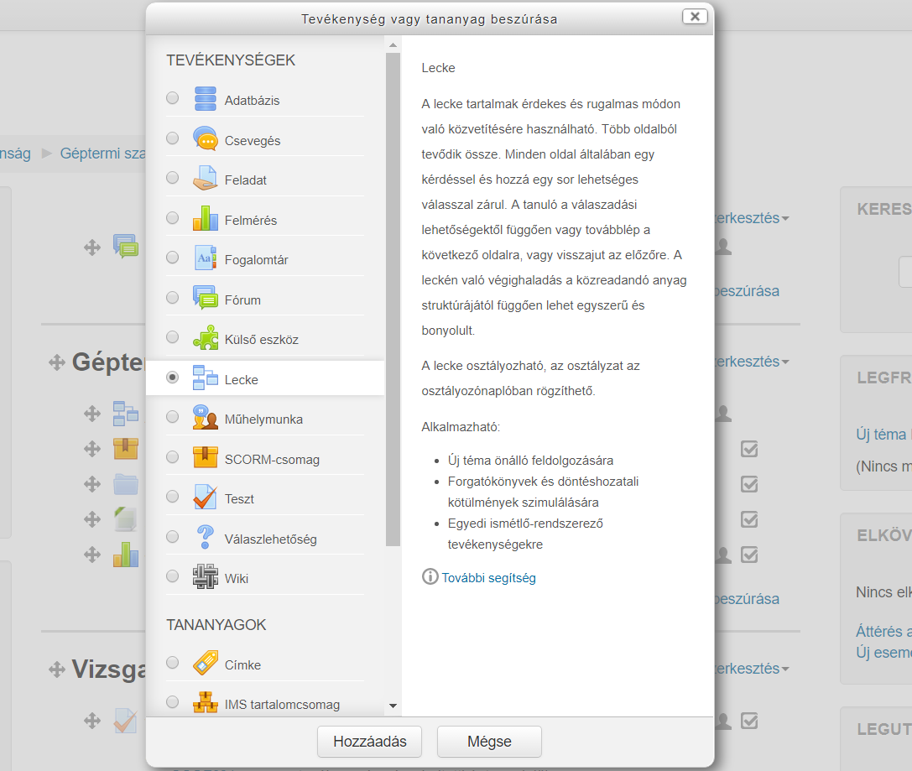

<<<

Miután rákattintottunk a btn:[Hozzáadás]-ra, megadhatjuk a Lecke paramétereit.

::
Általános:::

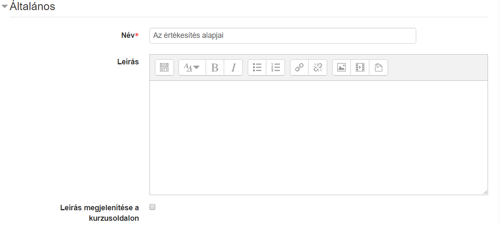
+
Itt adhatjuk meg a lecke nevét és leírását. Amennyiben kijelöljük a *Leírás megjelenítése a kurzusoldalon* opciót, akkor a kurzusoldalon a tananyag címe alatt megjelenik a leírás is.

Megjelenés:::

A *Megjelenés* szekció alatt a lecke lejátszófelületével kapcsolatos beállításokat tudjuk megadni.
+
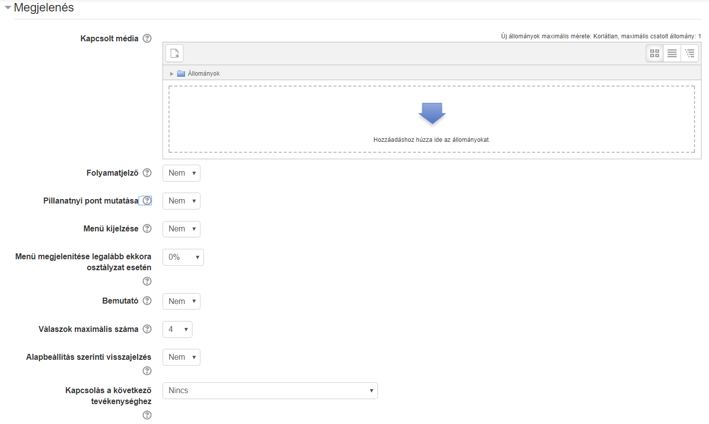
+
A *Kapcsolt média* a lecke összes oldaláról megnyitható a *Kapcsolt média blokkban*.

TIP: Ide töltsünk fel minden olyan hasznos csatolmányt, ami segítheti a megértést.

<<<

::
:::
A *Folyamatjelző* bekapcsolásával a tanuló egy grafikus folyamatjelzőn látja, hogy az anyag hány százalékát végezte el. A folyamatjelző jelenleg csak lineáris tananyagok esetén ad pontos értéket.
+
A *Pillanatnyi pont mutatása* opció bekapcsolásával a  tanuló nyomonkövetheti, hogy a maximálisan megszerezhetőből hány pontot gyűjtött össze.
+
A *Menü kijelzése* bekapcsolásával láthatóvá válik a tartalomjegyzék. Lehetőségünk van beállítani a *Menü megjelenítése legalább ekkora osztályzat esetén* érték állításával, hogy csak egy bizonyos eredmény fölött váljon láthatóvá, így garanálhatjuk, hogy a tanuló nem ugrik át a tartalomjegyzékből navigálva oldalakat, hanem azokon sorban végighalad.
+
A *Bemutató* mód bekapcsolásával a leckét rögzített szélességű és magasságú, testre szabott hátterű bemutatóként jeleníti meg a MOODLE.
+
A *Válaszok maximális száma* értéket állítva beállíthatjuk a válaszok maximális számát az egyes kérdéseknél.  A beállítás bármikor módosítható, mivel csak azt érinti, amit a tanár lát, nem pedig az adatokat. Nem szükséges egyedi visszajelző szöveget írnunk a kérdésekhez; az *Alapbeállítás szerinti visszajelzés* bekapcsolásával beépített visszajelző szövegek ("Helyes válasz", "Helytelen válasz") fognak megjelenni.
+
A *Kapcsolás a következő tevékenységhez* opcióval egy, a kurzusban lévő másik tevékenységre irányíthatjuk a tanulót a lecke végén.

Felvehetőség:::

Itt tudjuk megadni, hogy a tanulóink mikortól meddig érjék el a leckét. Az elvégzésnek beállíthatunk időkorlátot, illetve jelszóval védhetjük le a tartalmunkat.
+
image:./pics/lecke/felvehetoseg.png[align="center"]

<<<

::
Folyamat szabályozása:::

Ebben a pontban a leckére vonatkozó módszertani beállítások érhetőek el.
+
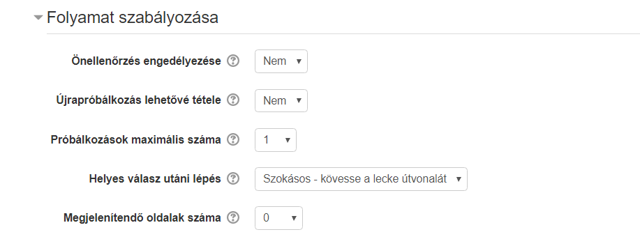
+
Az *Önellenőrzés engedélyezése* opció bekapcsolásával lehetővé tesszük, hogy a tanuló a leckében visszalépve módosítsa válaszait. Az *Újrapróbálkozás lehetővé tétele* opció bekapcsolásával engedélyezhetjük az újrapróbálkozást. Ennek számát a *Próbálkozások maximális száma* pontban állíthatjuk.
+
A *Helyes válasz utáni lépés* pontban megadhatjuk, hogy a következõ, a kihagyott vagy a még meg nem válaszolt oldalra ugorjon, ha a válasz helyes.
+
*Megjelenítendő oldalak száma*: csak akkor állítsuk be, ha az oldalakat különálló gyakorló kártyákként, úgynevezett Flash cardokként akarjuk használni. Ebben az esetben az oldalak nem függnek össze, bármilyen sorrendben elvégezhetőek. Ha ide értéket adunk meg, akkor a tanulók ennyi oldal megtekintése után fejezik be a leckét.

<<<

::
Pont:::

Ebben a részben a pontozásra vonatkozó beállítások érhetőek el.
+
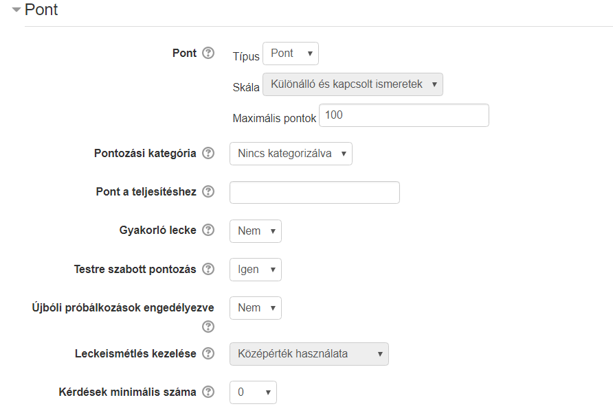
+
* *Pont*: a leckéért maximálisan szerezhető pont.
* *Pont a teljesítéshez*: hány pont szükséges, hogy a tevékenység teljesítettként jelenjen meg.
* *Gyakorló lecke*: "Igen"-re állítva a tevékenység nem jelenik meg a naplóban.
* *Testre szabott pontozás*: "Igen" esetén minden kérdéshez egyedileg állíthatunk be pontot.
* *Leckeismétlés kezelése*: amennyiben engedjük a tanulót újra próbálkozni, itt állíthatjuk be a pontszámítás módszerét, például hogy a legmagasabb pontot vagy a pontok átlagát vegye figyelembe a rendszer.

<<<

== Szerkesztés

Miután létrehoztuk a leckénket, különböző tartalmi elemekből állíthatjuk össze azt.

Ha még üres a leckénk, az alábbi listából választva tudjuk létrehozni az első oldalunk.

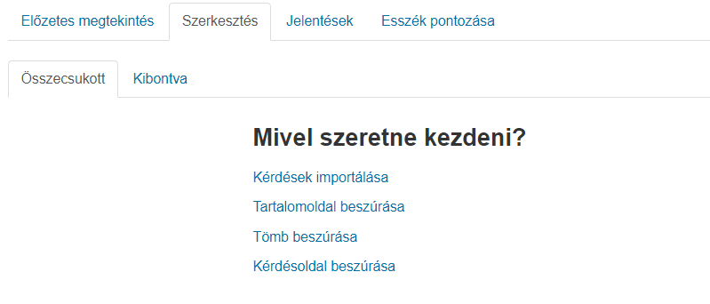

Amennyiben már vannak meglévő oldalak, a *Műveleketek* lenyíló mezőjéből kiválasztva tudjuk az új oldalt beszúrni.

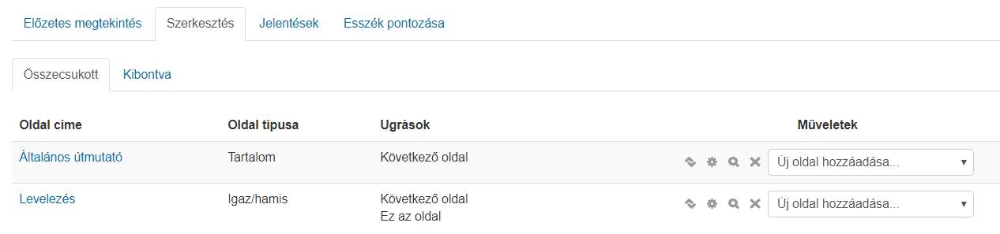

Az *Összecsukott* nézetben a meglévő oldalak címét, típusát és azt látjuk, hogy az oldalról hová lehet eljutni a különböző interakciók segítségével.

<<<

Ha a *Kibontva* fülre kattintunk, akkor az oldalak tartalmát is láthatjuk.

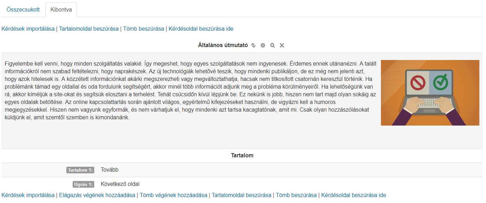

Oldaltípusok::

A tanulók  a *tartalomoldalt* és a *kérdésoldalt* látják a tananyagban. Ezen kívül lehetőségünk van még navigációs oldalakat is beszúrni, amik a tartalmat nem, csak a bejárási utat módosítják. Ilyen például a *Tömb* vagy az *Elágazás vége*.

Tartalomoldal:::

Tartalomoldalakat WYSIWYG szerkesztővel tudunk létrehozni. Megadhatjuk, hogy a *Tartalomgombok* vízszintesen jelenjenek-e meg, illetve, hogy az oldalunk látszódjon-e a menüben.
+
A *Tartalom* résznél hozhatjuk létre a *Tartalomgombjaink*. Meg kell adnunk a gomb feliratát a *Leírás*-ban, illetve azt, hogy hova ugorjon a tananyag a gomb megnyomása után. Azt, hogy hány gombot tudunk beállítani a Lecke beállításainál lévő *Válaszok maximális száma* érték növelésével vagy csökkentésével tudjuk módosítani.
+
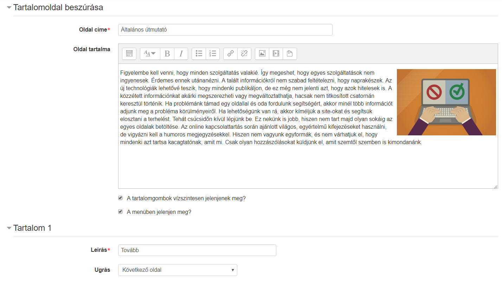

Ugrás::::

Lehetőségünk van Beállítani relatív (következő oldal, tananyag vége) és abszolút (konkrét oldal) ugrásokat a gombokhoz.

Kérdésoldal:::

Feleletválasztós::::
Megadhatjuk a kérdés nevét és szövegét. A *Feleltválasztós* jelölőnégyzet bekapcsolásával több helyes választ is megadhatunk (többválasztós feladat). Értelemszerűen ha üresen hagyjuk, csak egy jó választ állíthatunk be.
+
Azt, hogy hány választ állíthatunk be itt is, a Lecke beállításainál lévő *Válaszok maximális száma* értékétől függ.
+
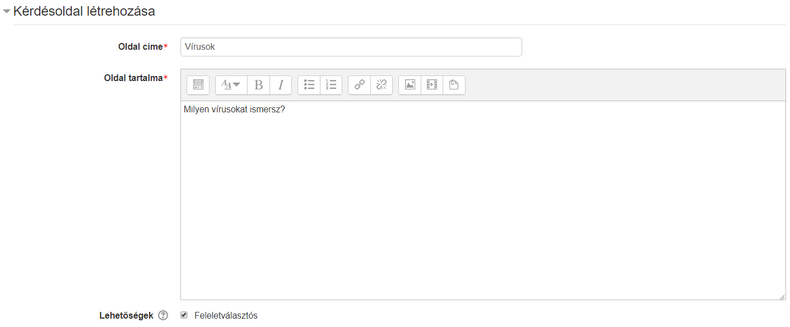
+
A *Válasz* mezőkben adhatjuk meg a válaszlehetőségeket. A *Tanuló válasza* mezőben adhatunk meg egyedi visszajelző szövegeket. A *Válasz 1* mindig jó választ tartalmaz. Ha ezen kívül szeretnénk még jó válaszokat megadni, akkor azoknak a válaszoknak az *Ugrás* lenyíló mezőjét állítsuk a Válasz 1-el megegyezőre, például jó válaszok esetén a Következő oldalra ugrik.
+
Egyedi pontszám csak akkor állítható, ha a Lecke beállításainál a *Testre szabott pontozás* lehetőséget bekapcsoltuk.
+
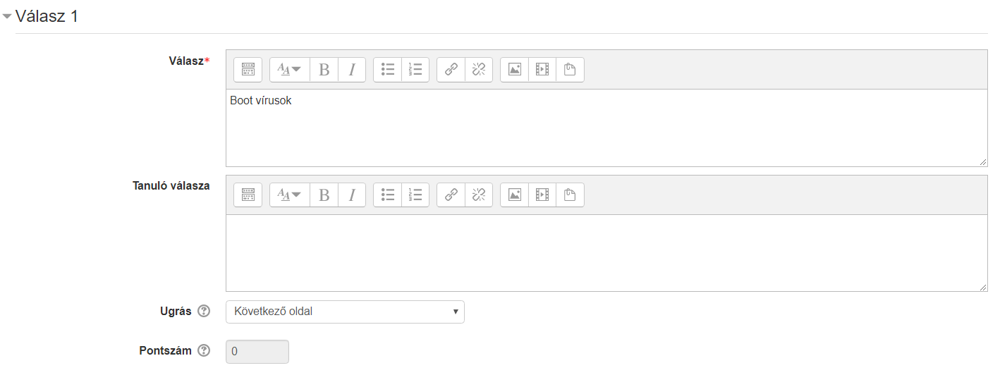

További kérdés típusok::::

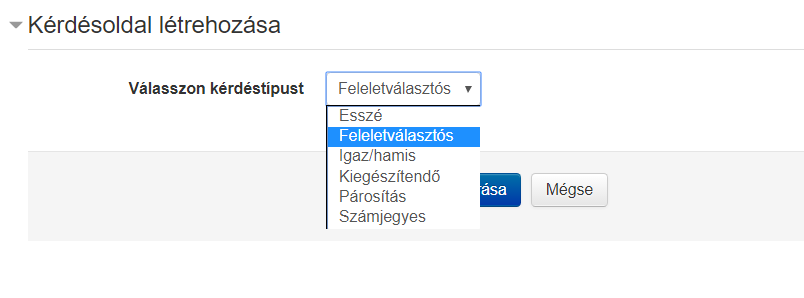

* *Esszé:* Hosszú szöveges válasz, amelyet a tanár értékel ki.
* *Igaz/hamis:* Hasonló, mint a feleletválasztós kérdés, csak a válaszok száma 2-re korlátozott.
* *Kiegészítendő:* Szövegkiegészítős feladat egy vagy több üresen hagyott hellyel.
* *Párosítós:* Szavak, képek, számok párosítása.
* *Számjegyes:* A feladat megoldásnak egy számot vár a felhasználótól.

Kérdések importálása:::

Meglévő fájlból importálhatunk kérdéseket, megegyező módon a Kérdésbank kérdéseinek importálásával.

Tömb:::

A Tömb akkor hasznos, ha egy kérdéscsoportot akarunk létrehozni, például egy több kérdésből álló tesztet, ahol a kérdések sorrendje véletlenszerű. A Tömb elejét a *Tömb beszúrása* a végét a *Tömb végének hozzáadásával* tudjuk jelölni.
+
TIP: Érdemes először a kérdéseket létrehozni, amelyek tömbbe akarunk rendezni, és utána hozzáadni a Tömb elejét és végét jelző szakaszhatárokat.
-
Elágazás vége:::

Egy navigációs oldal, amely egyetlen ugrást tartalmaz. Egy szakasz, például egy fejezet végét jelölhetük vele.

== Jelentések

A jelentések fülön *Áttekintés* és *Részletes statisztika* nézetben van lehetőségünk a tanulók eredményeit megtekinteni.

== Esszék pontozása

Amennyiben a lecke esszékérdést tartalmaz, itt tudjuk értékelni.
