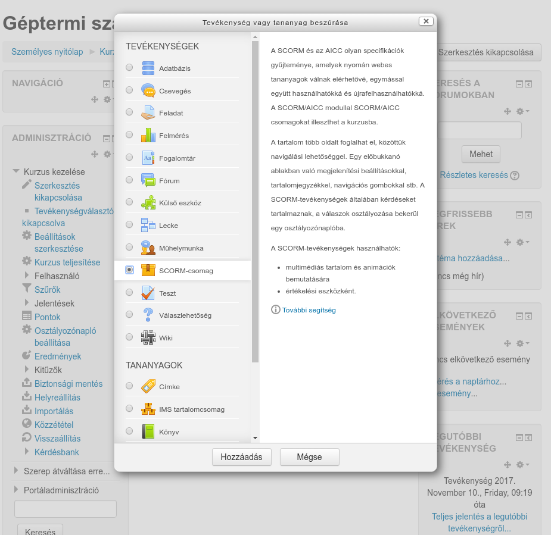
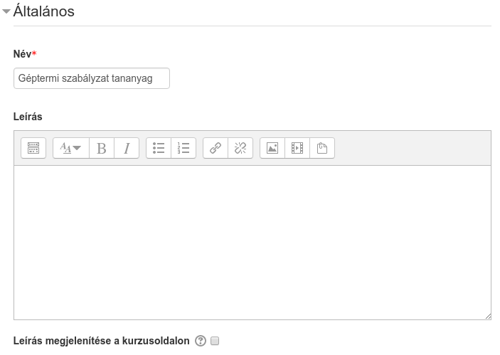
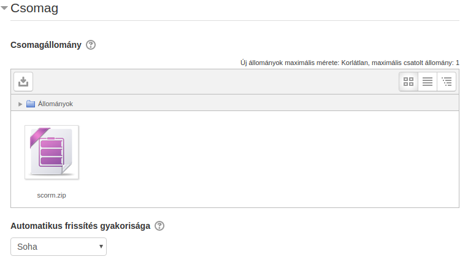
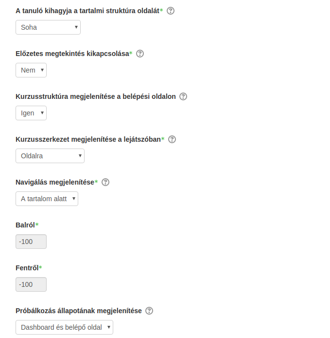
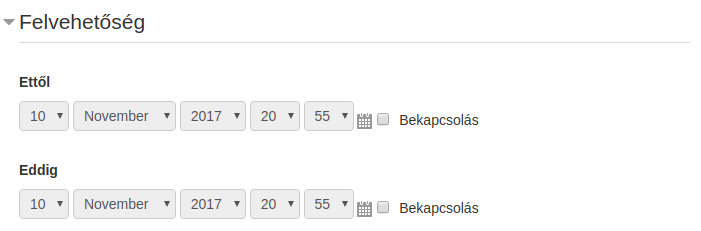
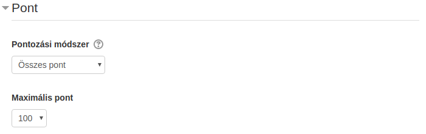
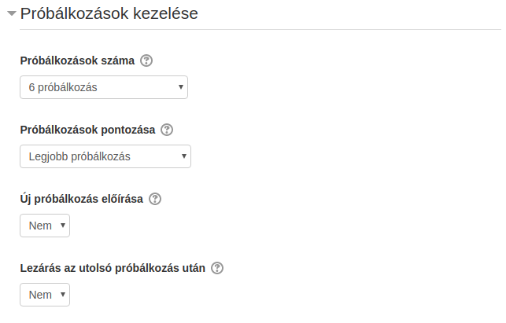
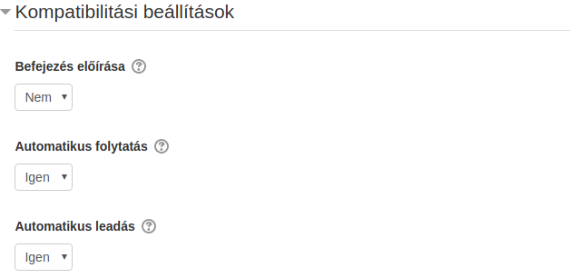
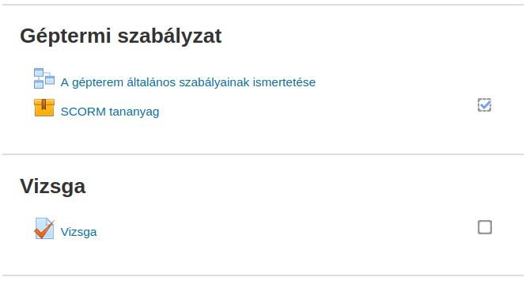
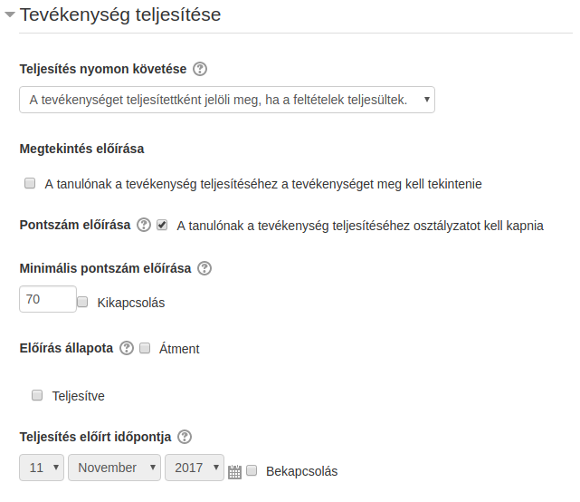

:icons: font
:experimental: enable
:toc: right
:doctype: book

[[scorm-tevekenyseg]]
= SCORM

A Moodle támogatja a SCORM (Sharable Content Object Reference Model) szabványt, ami egyrészt ajánlást ad a tartalom technikai csomagolásához, másrészt leírja, hogy milyen haladási információkat küldhet a tartalom a keretrendszernek.

Egy SCORM tananyag tanulási objektumokból, azaz SCO-kból (Sharable Content Object) épül fel, amelyek külön-külön tudnak haladási információkat küldeni az LMS-nek. Ilyen haladási információ, például hogy mennyi időt töltött egy-egy felhasználó az SCO-ban, milyen eredménnyel zárta azt, illetve milyen belső interakciókat hogyan oldott meg.

[NOTE]
--
Ez a szabvány elavult mind technológiában, mind funkcionalitásban. A legfrissebb verziója is 2004-es. A Moodle a SCORM 1.2-t támogatja, ami a 2004 előtti verzió, a 2004-et már nem is fogja. Helyette a SCORM-ot kiváltó xAPI-ra helyezik a hangsúlyt: https://experienceapi.com/overview/

A SCORM-ban az egyes tanulási objektumok (SCO) közti navigációt is az LMS szolgáltatja (és ezt támogatják is a keretrendszerek), viszont ennek kötöttsége miatt a tananyagokat mostanában nem külön SCOnként, hanem egy SCOs tananyagként állítják elő. Az LMS által szolgáltatott navigáció esetén például nincs lehetőség tananyagon belüli kereszthivatkozásokra, keresésre stb.
--

A funkcionalitást 2 fő részre bonthatjuk fel, ezek a következők:

* SCORM csomag feltöltése és beállítása
* eredmények riportozása

<<<

== SCORM csomag feltöltése és beállítása

Miután a kurzusunk oldalán bekapcsoltuk a szerkesztési módot, a *Tevékenység vagy tananyag beszúrása* segítségével tölthetünk fel SCORM tananyagot.

Miután rákattintottunk a btn:[Hozzáadás]-ra, megadhatjuk a tananyag paramétereit.

<<<

::
Általános:::

+
Itt adhatjuk meg a tananyag nevét és leírását. Amennyiben kijelöljük a *Leírás megjelenítése a kurzusoldalon* opciót, akkor a kurzusoldalon a tananyag címe alatt megjelenik a leírás is.

Csomag:::

+
Itt tudjuk feltölteni a SCORM csomagot.

Megjelenés:::

A *Megjelenés* szekció alatt a tananyag-lejátszóval kapcsolatos beállításokat tudjuk megadni.
+
A *Csomag megjelenítése* alatt meg tudjuk adni, hogy a tartalom új ablakban nyíljon-e meg. Ha az új ablakot választjuk, alatta sok opcióval szabályozhatjuk az ablak paramétereit.
+
[TIP]
--
A böngészők popup-blocker opciója miatt nem ajánljuk, hogy új ablakban nyíljon meg a tartalom.
--

== Belépési oldal
Amikor a tanuló megnyitja a tananyagot, akkor még a tartalom megjelenése előtt egy belépési oldal jelenik meg, ahol információt kap az eddigi próbálkozásairól.

A belépési oldalról a tanuló elindíthatja a tananyagot *Előzetes megtekintés* módban. Ilyenkor nem kap pontszámot, csak meg tudja tekinteni a tananyagot. Ezt ki is tudjuk kapcsolni az *Előzetes megtekintés kikapcsolása* segítségével. Ilyenkor csak a *Szokásos mód* lesz elérhető.

Azt, hogy ez a belépési oldal megjelenjen-e, *A tanuló kihagyja a tartalmi struktúra oldalát* opcióval tudjuk szabályozni.

A *Kurzusstruktúra megjelenítése a belépési oldalon* opcióval megjeleníthetjük a tartalomjegyzéket a belépési oldalon. Ennek csak akkor van értelme, ha nem 1 SCO-ból áll a SCORM csomag.

A *Próbálkozás állapotának megjelenítése* opció szabályozza, hogy az eddigi próbálkozások információi megjelenjenek-e.

== Lejátszó

A belépési oldalról a tanuló a lejátszóba kerül át, ezzel kapcsolatosan is beállíthatunk néhány dolgot.

*Kurzusszerkezet megjelenítése a lejátszóban* opcióval szabályozhatjuk, hogy hol jelenjen meg a tartalomjegyzék. Amennyiben a tananyag csak 1 SCO-ból áll, ezt kapcsoljuk ki.

A *Navigálás megjelenítése* opciónak is csak akkor van értelme, ha a tananyagunk nem rendelkezik beépített tartalomjegyzékkel, egyéb esetben kapcsoljuk ki. A funkció segítségével a tartalomjegyzéken kívül kapunk még egy panelt, amivel előre-hátra navigálhatunk a tartalomhierarchiában.

::
Felvehetőség:::

Itt tudjuk megadni, hogy a tanulóink mikortól meddig érjék el a tananyagunkat.
+

Pont:::

A *Pontozási módszer* alatt adhatjuk meg, hogy egy próbálkozás után hogyan számítódjon a pontszám az egyes tanulási objektumok által küldött pontszámokból.
+
* *Tudásegységek*: Ekkor a teljesített tanulási objektumok száma lesz a megszerzett pontszám
* *Legmagasabb pont*: A tanulási objektumok által küldött pontszámokból a tananyag a legmagasabbat kapja meg.
* *Átlagpont*: A tanulási objektumok által küldött pontszámokból vett átlag lesz a tananyagra kapott pont.
* *Összes pont*: Az tanulási objektumok által küldött pontszámok összegét kapja meg a tanuló.
+
[TIP]
--
Amennyiben a tananyag küld pontszámot (`cmi.score`), válasszuk az *Összes pont* opciót. Ez egy és több tanulási objektumos tananyag esetén is jó választás. Amennyiben nem küld pontot, akkor csak a *Tudásegységek* opciót tudjuk választani, amennyiben szükségünk van pontszámra.
--
+

<<<

Próbálkozások kezelése:::

Itt adhatjuk meg, hogy egy tanuló hányszor futhat neki egy tananyagnak, illetve a próbálkozásaiból melyik számítson bele a pontszámba.
+

+
Egy próbálkozás addig tart, amíg be nem fejezte azt a tanuló sikeres vagy sikertelen eredménnyel, de alapértelmezésben bármikor kezdhet új próbálkozást. Ezt kikapcsolhatjuk az *Új próbálkozás előírása* opció *Igen*-re állításával. Ilyenkor addig nem kezdhet új próbálkozásba, amíg az előzőt le nem zárta.
+
A *Lezárás az utolsó próbálkozás után* segítségével letilthatjuk a tananyag megnyitását, ha a felhasználó elérte a maximális próbálkozásszámot, de ezt nem ajánljuk.

Kompatibilitás:::

Itt a SCORM csomaggal kapcsolatos technikai finomhangolásokat végezhetjük el.
+
Ha egy tananyagunk nem küld `cmi.core.lesson_status` állapotot, akkor a *Befejezés előírása* opcióval ezt megtehetjük.
+
Több SCOs tananyag esetén automatikusan tudunk léptetni, miután egy tanulási objektumot már befejezett a tanuló. Ehhez kapcsoljuk be az *Automatikus folytatás* opciót.
+
Amennyiben tananyagunk nem küld sűrűn `LMSCommit()` hívást, kapcsoljuk be az *Automatikus leadás* opciót, így csökkentjük a lehetséges adatvesztés mértékét akkor például ha a tanuló bezárja a böngészőt.
+

Tevékenység teljesítése:::

Itt tudjuk beállítani, hogy amennyiben a kurzusnál be van kapcsolva a *Teljesítés nyomonkövetés*, a tananyag teljesítettségéhez mi szükséges.
+
Amikor a tananyagot teljesítette a felhasználó, megjelenik egy pipa a tananyag címe mellett, illetve a kurzusriportokban is teljesített lesz a tevékenység.
+

+
Ha a SCORM csomag által küldött információk alapján automatikusan teljesítetté szeretnénk tenni a tananyagot, a *Teljesítés nyomon követése* alatt válasszuk a *A tevékenységet teljesítettként jelöli meg, ha a feltételek teljesültek.* opciót.
+
Ha a *Pontszám előírása* opciót kiválasztjuk, a tevékenység teljesített lesz, ha a tanuló pontszámot szerez. Viszont ha a *Minimális pontszám előírása*-nál nem adunk pontszámot, bármekkora pontszámot el fog fogadni a teljesítettséghez, ezért ezt is adjuk meg ilyenkor.
+
Az *Előírás állapota* alatt adhatjuk meg, hogy akkor is teljesített legyen a tananyag, ha a SCORM csomag *Átment* (`completed`) vagy *Teljesítve* (`passed`) állapotot küld. Viszont arra figyelni kell, hogy több SCOs tananyag esetén ha az első SCO teljesített lesz, akkor már az egész tananyagot teljesítettnek veszi a Moodle.
+
[TIP]
--
Ha feltöltjük a tananyagunkat a Scorm Cloud-ra, le tudjuk tesztelni, hogy milyen SCORM adatokat küld a csomag: https://cloud.scorm.com
--
+

