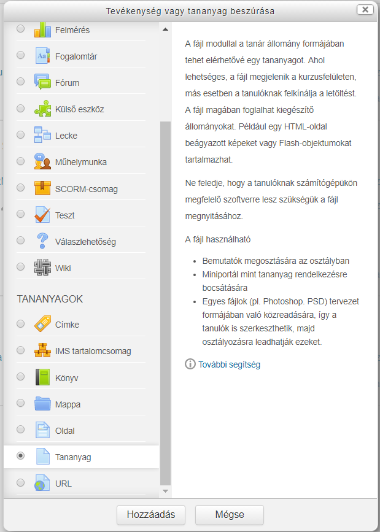
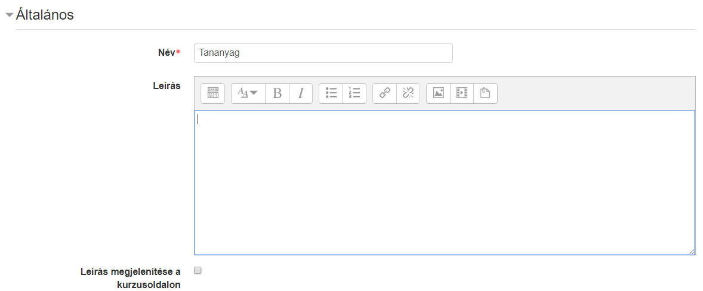
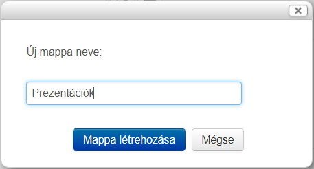
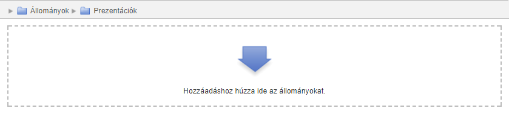
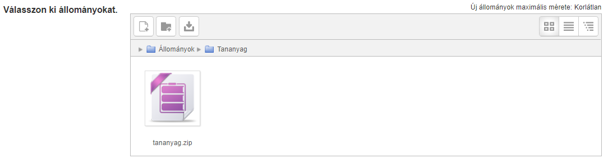
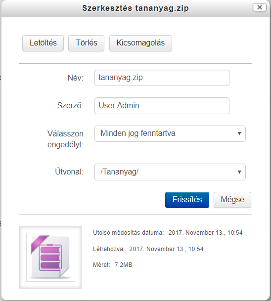
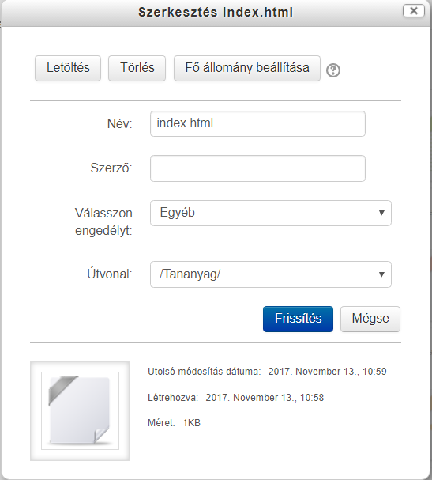
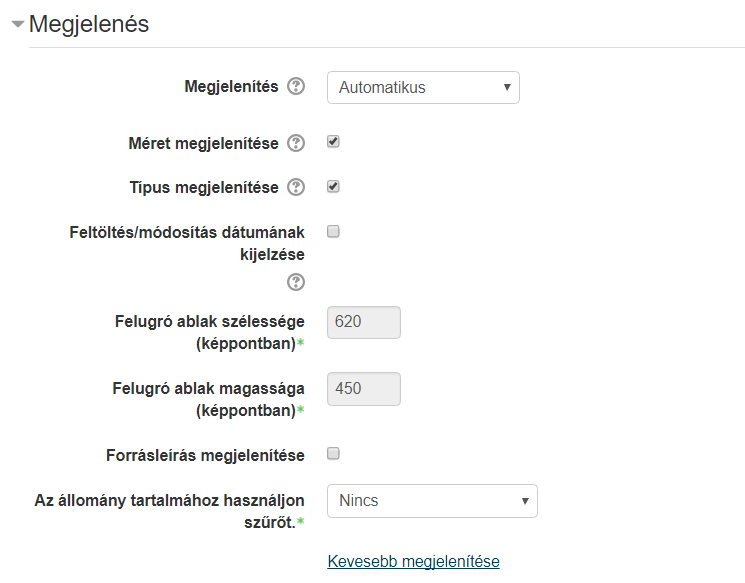

:icons: font
:experimental: enable
:toc: right
:doctype: book

[[tananyag-tananyag]]
= Tananyag

Tananyag hozzáadásával letölthető fájlokat vagy több fájlból álló állományokat, például e-learning tananyagokat - nem SCORM-os - tehetünk a tanulóknak elérhetővé.

[NOTE]
Több fájl feltöltése esetén mindig meg kell adnunk egy indító állományt (amiből csak egy darab lehet), például egy HTML oldal és a hozzá tartozó képek esetén indító állományként magát a HTML fájlt kell megadnunk.

== Tananyag létrehozása és beállításai

Miután a kurzusunk oldalán bekapcsoltuk a szerkesztési módot, a *Tevékenység vagy tananyag beszúrása* segítségével hozhatjuk létre a Tananyagot.

.Tananyag létrehozása

<<<

A btn:[Hozzáadás] gombra kattintva megadhatjuk a Tananyag paramétereit.

Általános::

+
Itt adhatjuk meg a tananyag nevét és leírását. Amennyiben kijelöljük a *Leírás megjelenítése a kurzusoldalon* opciót, akkor a kurzusoldalon a tananyag címe alatt megjelenik a leírás is.

Tartalom::

Itt tölthetjük fel a kívánt fájlokat.

Mappa létrehozása::

Átláthatóbbá tehetjük a fájlokat, ha azokat mappákba szervezzük. Mappát létrehozni a *Mappa létrehozása* ikonnal tudunk.
+

+
Miután létrehoztuk, egyszerűen kattintással belelépünk, majd elvégezzük a fájl feltöltést a megszokott módon. A mappákba további almappákat is létrehozhatunk.

<<<

::
A feltöltő felület morzsa (breadcumb) menüje segít eligazodni, hogy éppen melyik mappában vagyunk.
+

Több fájlból álló állomány - például tananyag - feltöltése:::

Töltsük fel a kívánt anyag zip fájlját.
+

<<<

::
Ezután kattintsuk rá és válasszuk a btn:[Kicsomagolás] opciót.
+

<<<

::
:::
Ezután már csak az indító fájlt kell megadnunk. Kattintsunk a kiválasztott fájlra, majd a btn:[Fő állomány beállítása] gombra.
+

<<<

Megjelenítés::

Itt állíthatjuk be, hogy hogyan viselkedjenek a fájlok, ha a tanuló rájuk kattint. Például, hogy megnyíljanak vagy letöltse őket a saját gépre.
+

