:icons: font
:experimental: enable
:toc: right
:doctype: book

[[teszt-tevekenyseg]]
= Teszt (vizsga)

A Moodle teszt modulja sok opcióval rendelkezik, emiatt elég rugalmas.
Különböző kérdéstípusokat állíthatunk be, előre összeállított kérdésekből véletlenszerűen is tud választani a program, magától ki tudja értékelni a teszteket, a diák akár többször is próbálkozhat.

Magát a funkcionalitást 3 fő részre bonthatjuk szét, ezek a következők:

* kérdések összeállítása
* a kiírás paramétereinek beállítása
* eredmények riportozása

== Kérdésbankok

A tesztkérdések kérdésbankokba kerülnek be.
Ez azért jó, mert így építhetünk magunknak egy tesztkérdés tárat, majd az egyes vizsgákhoz ezen kérdésekből válogathatunk kérdéseket.

A kérdésbankok különböző objektumokhoz tartozhatnak:

::
az adott teszt **tevékenységhez:**:::

a kurzuson belül található teszt tevékenységhez. Ilyenkor a kérdésekhez csak az adott teszt tesztsora fér hozzá.

**kurzushoz**::: ha a kurzuson belül több *Teszt* vagy *Lecke* tevékenység van, ezekhez felvehetünk a kurzus kérdésbankjából kérdéseket.

**kurzuskategóriához**::: a kurzuskategóriában található kurzusokban elérjük a kurzuskategória kérdésbankját.
**rendszer szinthez**::: a rendszer összes kurzusában felhasználhatjuk az ezen a szinten lévő kérdéseket.

<<<

A következő ábra a kérdésbankok elhelyezkedésének lehetőségét mutatja:

.Kérdésbankok
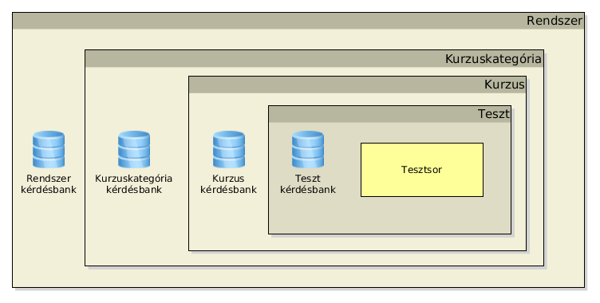

<<<

Itt pedig egy valós példát láthatunk a Moodle-ból:

.Kérdésbankok a Moodle-ban
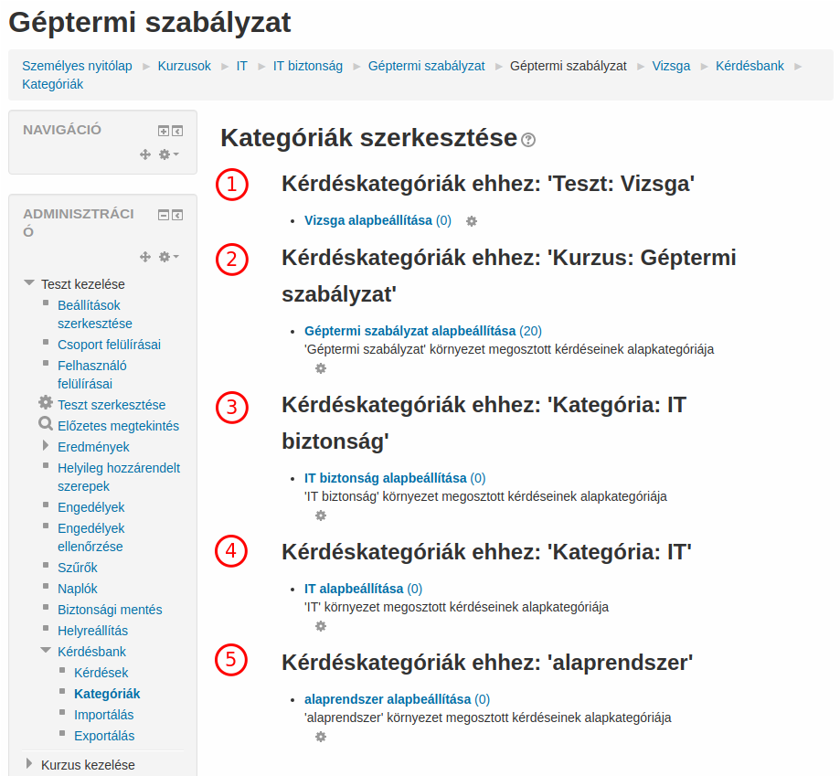

Az egyes pontok jelentése:

1. A *Géptermi szabályzat* kurzus alatt található *Vizsga* teszthez tartozó kérdésbank
2. A *Géptermi szabályzat* kurzushoz tartozó kérdésbank
3. Az *IT biztonság* kategóriához tartozó kérdésbank
4. Az *IT* kategóriához tartozó kérdésbank
5. A legmagasabb szinten az **alaprendszer** található

Az alaprendszer a legmagasabb szinten van, az itt található kérdések a rendszer minden kurzusában felhasználhatóak lesznek.

NOTE: Érdemes a kérdéseket legalább a kurzushoz tartozó kérdésbankba felvenni, így azok újrafelhasználhatóak lesznek, ha egy új vizsgát akarunk majd kiírni.

WARNING: Amikor módosítunk egy kérdést a kérdésbankban, a kérdést felhasználó tesztekben is azonnal látszik a módusulás, viszont ha az eredményt befolyásoló módosulás történik, akkor a vizsgát újra kell pontozni. Erről később lesz szó a riport-oknál.

NOTE: Amennyiben törlünk egy kérdést a kérdésbankból és azt felhasználtuk már tesztben, akkor a teszből nem fog törlődni a kérdés.

=== Kérdésbank kategóriák

A különböző kérdésbank szinteken belül felvehetünk kategóriákat is, így még átláthatóbb lesz a kérdésbankunk.

TIP: A kérdésbank kategóriák az átláthatóságon kívül azért is jók, mert az adott vizsga összeállításánál meg tudjuk mondani, hogy adott kategóriából hány véletlenszerű kérdést ajánljon fel.

==== Kérdésbank kategóriák szerkesztése

A kategóriák szerkesztéséhez nyissunk meg egy kurzust a menu:Portáladminisztráció[Kurzusok > Kurzusok és kategóriák kezelése] alatt, majd a válasszuk a menu:Kurzus kezelése[Kérdésbank > Kategóriák] menüpontot.

Itt tudunk új kategóriát létrehozni, alapadatokat módosítani, illetve kategóriát törölni.

===== Kategória létrehozása

Az új kategória létrehozásánál a menu:Felettes kategória[] lenyíló menüben megadhatjuk, hogy ki legyen a kategória szülője. Itt ugyanúgy megtalálhatjuk a fent említett kérdésbank szinteket.

.Új kategória létrehozása
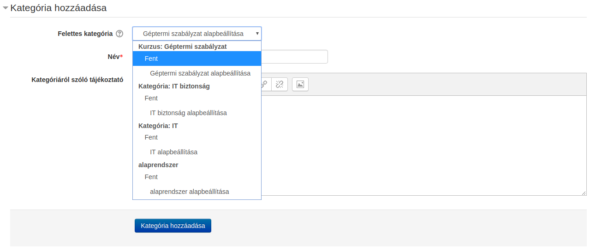

TIP: A menu:Fent[] azt jelenti, hogy az adott szinten lévő kérdésbank legfelsőbb szintű kategóriája lesz az újonnan létrehozott.

=== Kérdések kézi létrehozása

Ha készen vagyunk a kategóriákkal, akkor a menu:Kérdésbank[Kérdésekre] kattintva elkezdhetjük feltölteni őket kérdésekkel.

A kérdéskategória kiválasztása lenyíló ablakban kiválaszthatjuk, hogy melyik kategóriába szeretnénk a kérdéseket létrehozni. Ezután az btn:[Új kérdés létrehozása] gombra kattintva megadhatjuk a kérdés típusát.

.Új kérdés létrehozása
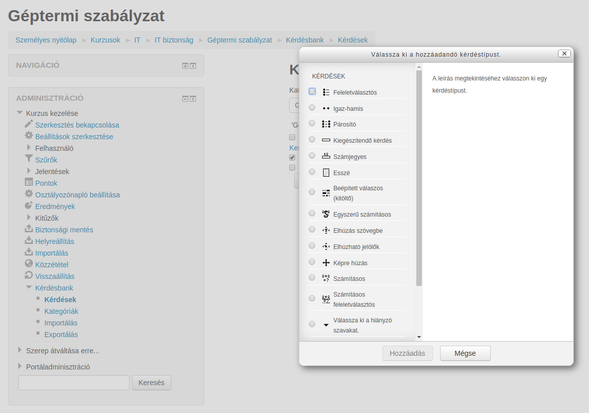

==== Fontosabb kérdésbeállítások

A most következőkben a *feleletválasztós kérdésen* keresztül mutatjuk be a legfontosabb kérdésbeállításokat.

::
Feleletválasztós:::

Kérdés neve::::
A kérdést azonosító név.
+
[IMPORTANT]
--
Fontos, hogy menu:A Kérdés nevének[] ne a kérdés szövegét adjuk meg, hanem valami azonosítót, mert ez fog minden listában látszani. Hosszú kérdéseknél, ahol csak az első 3 szó látszana, majdnem lehetetlen lesz rájönni, hogy melyik kérdésről van szó.
--

Kérdés szövege::::
Képpel, médiával fűszerezhető formázott szöveg.

Alapjegy::::
Alapértelmezésben minden kérdésnél *1*, ennek segítségével adhatunk súlyt egy-egy fontosabb kérdéseknek a vizsgán belül.

Általános visszajelzés::::
A kérdés kitöltése után megjelenő visszajelző szöveg.

Egy vagy több válasz?::::
Ez már konkrétan *Feleletválasztós* kérdéstípus paramétere, megadhatjuk, hogy egy vagy több helyes válasz tartozik-e a kérdéshez.

A válaszlehetőségeket keverje össze?::::
A kérdés válaszainak sorrendje minden kitöltőnél véletlenszerű lesz. Nagyban csökkenti a csalás lehetőségét.

Válaszlehetőségek számozása?::::
Megjelenési beállítás

Válaszok::::
Itt vehetjük fel az egyes válaszokat. Minden válaszlehetőség alatt van egy lenyíló mező, amiben állítható, hogy az adott válasz mennyit ér. Ennek a mezőnek természetesen csak több válasz esetén van jelentősége.
+
[[quiz-minus-percent]]
[IMPORTANT]
--
*Mínusz százalékok* is beállíthatóak! Erre azért van szükség, mert ha 4 válaszból 2 jó és erre a kettőre 50% - 50%-ot állítok be, akkor is 100%-ot fog a rendszer adni, ha mind a 4 lehetőséget kiválasztottam. Érdemes tehát a rossz válaszokra büntető pontokat adni, -50%-ot, így ha mind a 4-et kiválasztja, az eredménye arra a feladatra 0. Mínusz pontot nem kaphat a feladatra.

Akkor jár a maximális pont (100%), ha a két jó választ jelölte csak be. Ha 2 jó választ és egy rosszat, vagy ha csak egy jó választ (100% - 50% ill. 50%) jelölt, akkor a maximális pont felét kapja. Ha minden választ bejelölt, akkor a két jó válaszért megkapja a maximumot, de a két rossz miatt -100%-ot le is vonunk, így az elért pontszáma 0.
--
+
Az egyes válaszokhoz megadhatunk egyedi visszajelzést, ami akkor jelenik meg ha az adott választ jelölte be a tanuló. Pl. "Ez a válasz azért nem helyes, mert..."

Egyesített visszajelzés::::
Milyen üzenet jelenjen meg a visszajelzéskor teljesen jó, részben jó, illetve helytelen válaszok esetén. Pl. ha rossz a válasza, akkor kiírhatjuk, hogy hol találja az ide vonatkozó tananyagrészt, amit érdemes átnéznie.

<<<

::
:::
Többszöri próbálkozás beállításai::::
Ha kérdéseit *Adaptív üzemmód* mellett futtatja és a résztvevő többször próbálkozhat a kérdés helyes megválaszolása érdekében, akkor ez a beállítás szabályozza a levonásokat egy-egy hibás válasz esetén.
A levonás a kérdés összpontszámának százalékos aránya, így ha egy kérdés három pontot ér és a levonás 0,333333, a résztvevő az első helyes próbálkozására 3, a másodikra 2, a harmadikra 1 pontot kap.
+
[TIP]
--
Ezt az üzemmódot gyakoroltatásnál, gyakorló teszteknél alkalmazzuk, semmiképp sem vizsgahelyzetben.
--

Címkék::::
Jelenleg nincsenek használva a rendszerben az itt megadott címkék.

==== További választós kérdéstípusok pár szóban

::
:::
Igaz-hamis::::
A feleletválasztós kérdések egyszerű formája, mely csak két választási lehetőséggel rendelkezik: igaz és hamis válasszal.
+
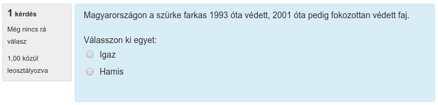

==== Beírós kérdéstípusok
::
:::
Kiegészítendő kérdés::::
Szabadszöveges válasz. Több válaszlehetőség is megadható.
+
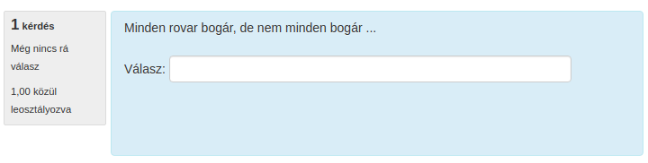

<<<

Számjegyes::::
Numerikus válasz, kezel mértékegységeket is, illetve hibahatárt is be lehet állítani.
+
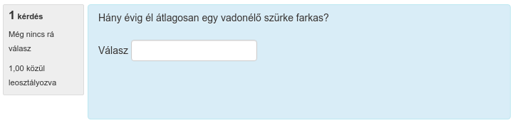

Esszé::::
Kifejtős kérdés, csak tanári értékeléssel pontozható.
+
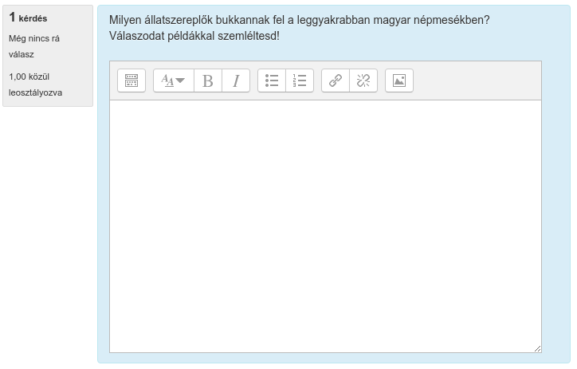

<<<

==== Párosítós kérdéstípusok

::
:::
Párosító::::
Egyszerű párosítás.
+
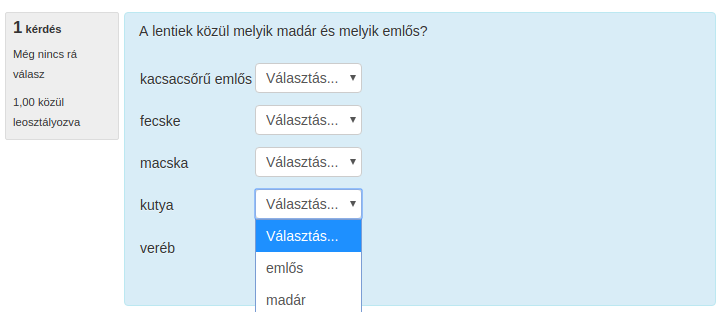

Véletlenszerű kiegészítő párosító::::
Ugyanaz, mint a *Párosító*, viszont a kérdéseket és a hozzájuk tartozó lehetőségeket a kérdésbank azonos kategóriájában szereplő *Kiegészítendő kérdés* típusú kérdésekből gyűjti össze.
+

<<<

==== Szövegkitöltős kérdéstípusok
::
:::
Beépített válaszos (kitöltő)::::

Szövegkitöltő úgy, hogy a szövegbe beágyazhatóak beírós és választós beviteli mezők.
+
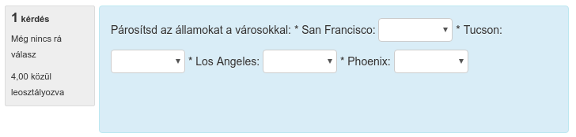

Válassza ki a hiányzó szavakat::::

Szövegkitöltős választási lehetőségekkel.
+
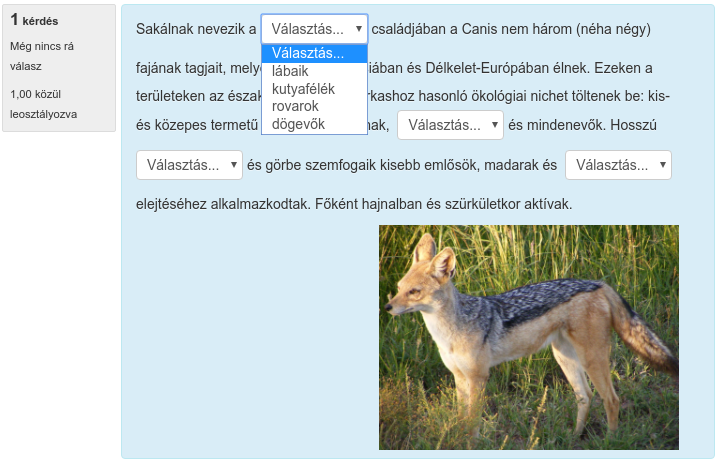

<<<

Elhúzás szövegbe::::

Szövegkiegészítős feladat úgy, hogy az egyes válaszlehetőségeket drag&drop-al lehet behúzni.
+
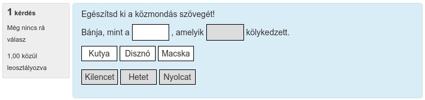

==== Képre húzós feladatok
::
:::
Elhúzható jelölők::::

Képre a megfelelő helyekre kell behúzni szöveges címkéket.
+
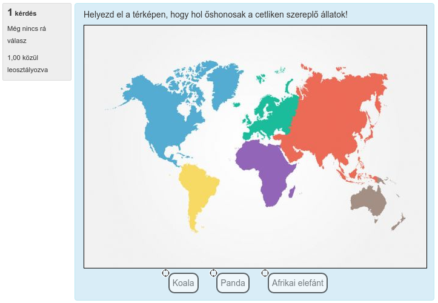

<<<

::
:::
Képre húzás::::

Képet lehet képre húzni.
+
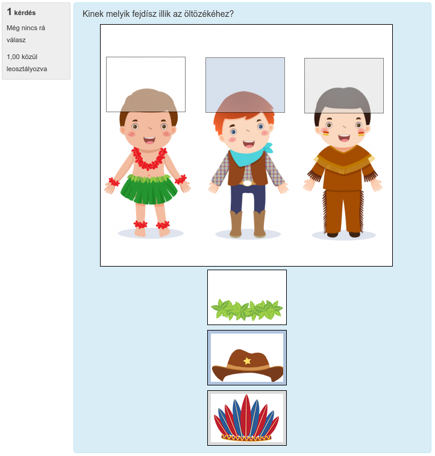

<<<

==== Számításos kérdéstípusok

::
:::
Egyszerű számításos::::

Képlet eredménye adható meg úgy, hogy a képletben szereplő változókat véletlenszerűen generálja a rendszer.
+
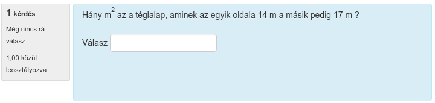

Számításos::::

Képlet eredménye adható meg úgy, hogy a képletben szereplő változókat véletlenszerűen generálja a rendszer. További beállítási lehetőségeket ad az *Egyszerű számításos*-hoz képest.
+
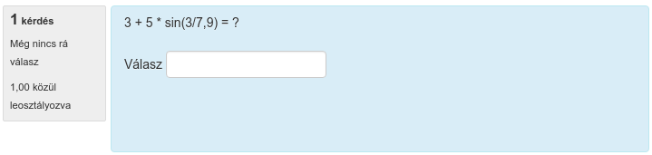

Számításos feleletválasztós::::

Képlet eredményét több érték közül választhatja ki a tanuló.
+
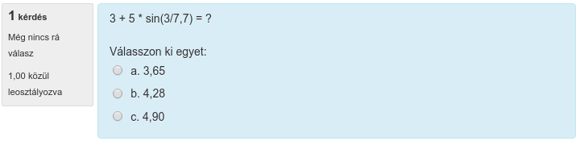

==== Egyéb
::
::::
Leírás::::

Segítségével plusz információkat szúrhatunk be a tesztlapra.

<<<

=== Kérdések importálása

A kérdések Moodle felületén történő felvételén kívül van lehetőségünk külső forrásból importálni kérdéseket. Több formátumot támogat a Moodle, mi az Excel-ből való importálás lépéseit fogjuk ismertetni.

=== Kérdések importálása Excel-ből

Segítségül fogjuk hívni az link:files/excel_kerdesek_sablon.xlsm[Excel sablont], mely makrók segítségével készít Moodle *GIFT* formátumú tesztet, amit ezután importálhatunk a Moodle-ba.

NOTE: Forrás: https://moodle.org/mod/forum/discuss.php?d=66660

A munkafolyamat a következő:

1. Excel sablon feltöltése kérdésekkel
2. Az Excelből GIFT formátum előállítása
3. A létrehozott GIFT formátumú fájl importálása a Moodle-ba

==== Excel sablon feltöltése kérdésekkel

.Excel sablon feltöltése kérdésekkel
image::./pics/tesztek/excel2gift_excel.png[Excel sablon feltöltése kérdésekkel]

TIP: Minden kérdésnél opcionálisan megadhatjuk a *Question Name* mezőt, ez szolgál a kérdés könnyű azonosítására az adminisztrációs felületen. Ez alapján tudjuk majd pl. kategorizálni a kérdéseket a Moodle-ban.

A *QUESTION* lesz a kérdés szövege. Ezt kötelező megadnunk.

TIP: A *QUESTION* mezőben ha *félkövér* formázást adunk egy szövegrésznek, az a Moodle-ban is félkövér lesz.

<<<

Ezután a kérdéstípus a válaszok megadási módjától függ majd. A sablon segítségével a következő kérdéstípusokat vehetjük fel:

* Igaz-hamis
* Egyválasztásos
* Többválasztásos
* Rövid válasz

===== Igaz-hamis

* Az *ANSWER1* mezőbe igaz esetén *T*-t írjunk, hamis esetén *F*-et.
* Az *ANSWER2* mezőt hagyjuk üresen.
* A *GRADE1* és *GRADE2* mezőt nem vesszük figyelembe.
* A *FEEDBACK1* mezőbe írjuk a helyes válasz esetén megjelenített visszajelző szöveget (opcionális), a *FEEDBACK2*-be kerül a helytelen válasz esetén megjelenített visszejelző szöveg (opcionális).

===== Egyválasztásos

* Legalább az *ANSWER1* és az *ANSWER2* megadása kötelező.
* A helyes válasz *Grade*-jénél *+100%*-ot állítsunk be, a többi válasz esetén *0%*-ot.

===== Többválasztásos

* Legalább az *ANSWER1* és az *ANSWER2* megadása kötelező.
* Legalább két válaszhoz 0-nál nagyobb *Grade*-et adjunk meg, az összegüknek *+100%*-nak kell lennie.
* A többi válasznál a *Grade*-nek 0-nak vagy nullánál kisebbnek kell lennie.

WARNING: Amennyiben többválasztós kérdésnél a rossz válaszoknál *0%* van megadva, akkor a *Set the grade of all incorrect answers (grades less than or equal to 0) to -100%* legyen bejelölve az Excel sablonban, mert egyébként ha minden választ bejelöl, akkor is megkaphatja a maximális pontszámot. További információ: <<quiz-minus-percent, Mínusz százalékok>>

===== Rövid válasz

* Legalább az *ANSWER1* és az *ANSWER2* megadása kötelező. Ezekbe kerülnek az alternatív megoldások
* Minden válasz *Grade* mezője legyen nullánál nagyobb, de egy válasznál legyen *+100%*

<<<

==== Az Excelből GIFT formátum előállítása

===== Exportálás

Miután feltöltöttük az Excel-t a kérdésekkel, exportáljunk belőle GIFT formátumot. Ehhez kattintsunk az Excel-ben a menu:Bővítmények[Excel2GIFT > Export to GIFT] menüpontra.

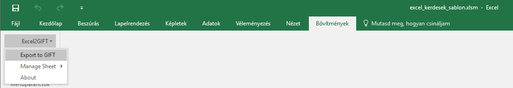

[TIP]
--
Amennyiben nem jelenik meg a *Bővítmények* menüpont, engedélyezzük a makrókat!

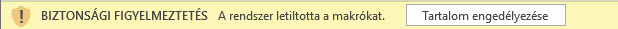
--

Ezután adjuk meg a fájl nevét (pl. `kerdesek.txt`), majd kattintsunk a btn:[Mentés] gombra. Ha minden rendben volt a kérdésekkel, megjelenik az összesítés:

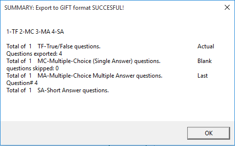

===== UTF-8 kódolás megadása

Ezután nyissuk meg az elmentett `kerdesek.txt`-t *Windows Jegyzettömbben*, majd a válasszuk a menu:Fájl[Mentés másként...] menüpontot. A mentés ablakban a *Kódolás*-nál válasszuk ki az *UTF-8*-ot, majd kattintsunk a btn:[Mentés] gombra.

Az így létrehozott fájlt ezután tudjuk importálni a Moodle-ba.

<<<

==== A létrehozott GIFT formátumú fájl importálása a Moodle-ba

A GIFT fájl importálásához nyissunk meg a kurzust a menu:Portáladminisztráció[Kurzusok > Kurzusok és kategóriák kezelése] alatt, majd a válasszuk a menu:Kurzus kezelése[Kérdésbank > Importálás] menüpontot.

.GIFT formátumú fájl importálása a Moodle-ba
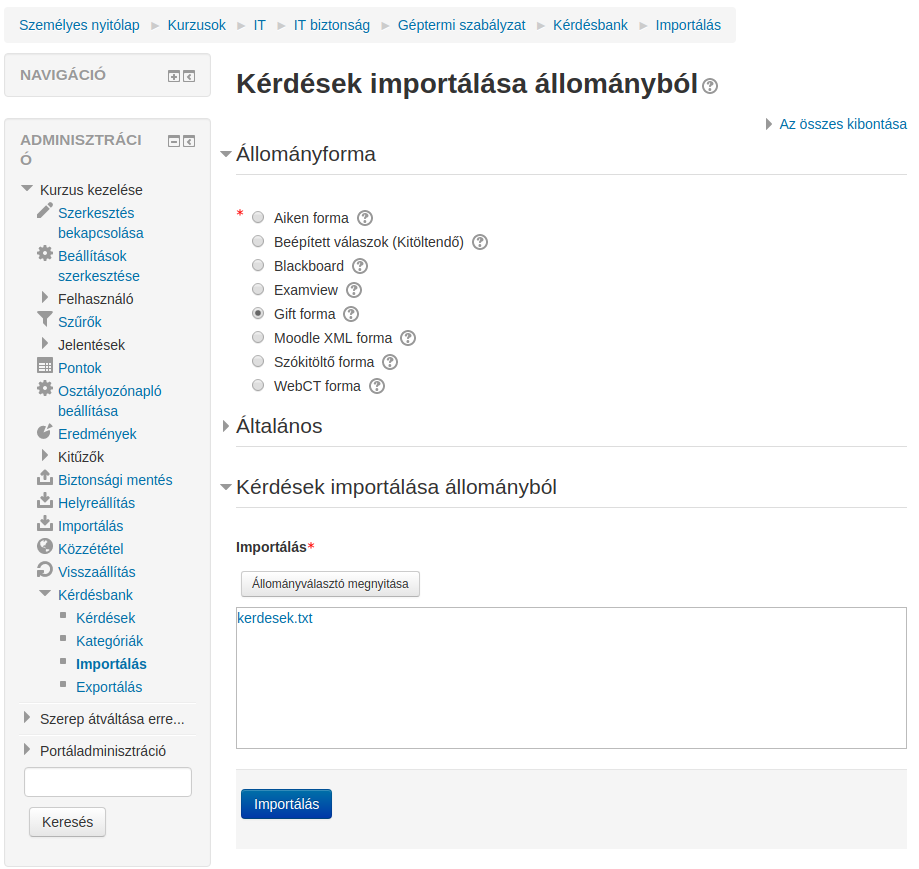

1. Válasszuk ki a *Gift forma*-t.
2. Töltsük fel a létrehozott `kerdesek.txt`.
3. Kattintsunk az btn:[Importálás] gombra. Ezután ha az importálás sikeres volt, a kérdésbankban megtaláljuk újonnan importált kérdéseinket.

TIP: Ha meg akarjuk adni, hogy a kérdések mely kategóriába legyenek importálva, ezt az *Általános* szekció alatt találjuk, ami alapértelmezetten rejtett.

== Teszt (vizsga) létrehozása

Miután létrehoztuk / importáltuk kérdéseinket a kérdésbankba, létrehozhatjuk a tesztsort.

Nyissunk meg egy kurzust és kapcsoljuk be a szerkesztési módot a btn:[Szerkesztés bekapcsolása] gomb segítségével, majd kattintsunk a menu:Tevékenység vagy tananyag beszúrása[] linkre a megfelelő témában. A megjelenő ablakban válasszuk a *Teszt* tevékenységtípust.

.Tesztsor létrehozása
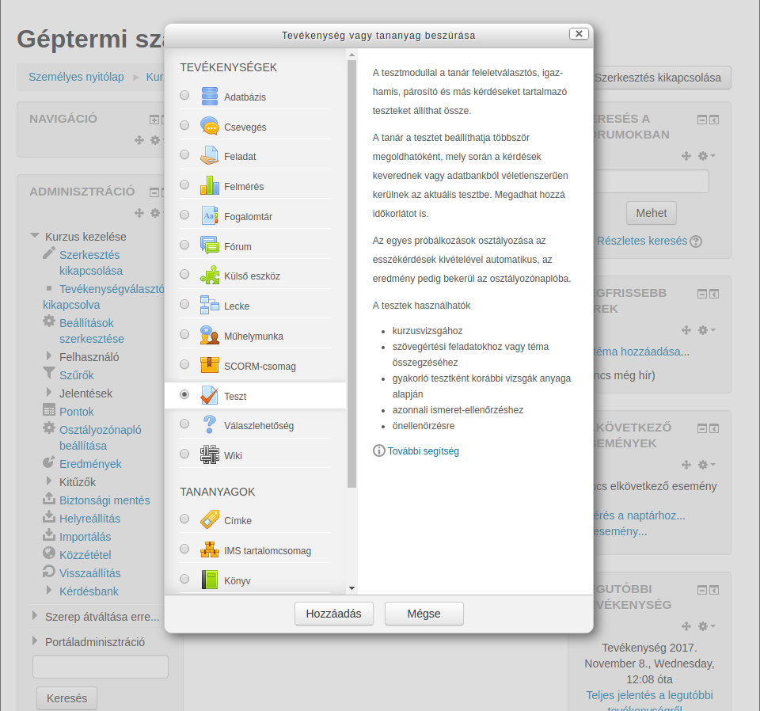

A megjelenő űrlapon adhatjuk meg a teszt paramétereit.

<<<

=== Teszt paraméterei

::
:::
Általános::::

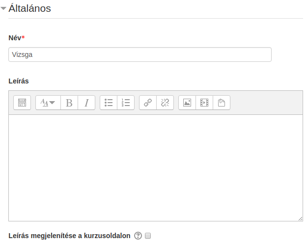
+
Itt adhatjuk meg a teszt nevét és leírását. Amennyiben kijelöljük a *Leírás megjelenítése a kurzusoldalon* opciót, akkor a kurzusoldalon tesztsor címe alatt megjelenik a leírás is.

<<<

Időmérés::::

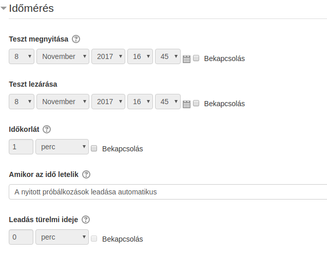
+
A *Teszt megnyitása* és *Teszt lezárása* opciókkal korlátozhatjuk, hogy a felhasználók milyen időszakban nyithatják meg a tesztsort. Látni fogják, hogy ott van, de nem tudják megnyitni.
+
Az *Időkorláttal* szabályozhatjuk a teszt kitöltéséhez adott időt, illetve megadhatjuk, hogy mi történjen ha letelik az idő.
+
[TIP]
--
Vizsga esetén mindenképpen szükséges időkorlátot megadnunk. Ügyeljünk arra,
hogy ez se túl rövid, se túl hosszú ne legyen. Ilyenkor egy folyamatjelző, visszaszámláló
időmérő ablak jelenik meg a képernyőn. Ha az időmérő lejár, alapértelmezés szerint a teszt leadása automatikusan
megtörténik, függetlenül attól, hogy mennyi válasz született meg akkorra.

Ilyenkor az *engedélyezett próbálkozások számát állítsuk 1-re*. Gyakorló teszteknél is
érdemes a próbálkozások számát limitálni.
--
+
[TIP]
--
Pótvizsga engedélyezés::
Amennyiben egy-egy felhasználónak szeretnénk plusz pótvizsga alkalmat biztosítani, azt a menu:Teszt kezelése[Felhasználó felülírásai] alatt tudjuk megtenni. Itt ki tudjuk választani a felhasználót és felül tudjuk írni a tesztnél beállított *Engedélyezett próbálkozás* számot.
--

<<<
::
:::
Pont::::

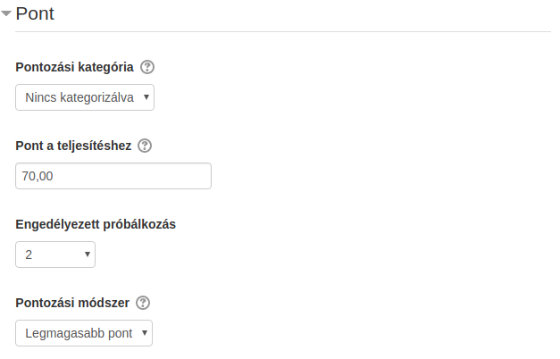
+
A *Pont a teljesítéshez* alatt adhatjuk meg, hogy hány pont szükséges a teszt teljesítéséhez. Ha a felhasználó eléri ezt a pontszámot, a tevékenység sikeresre lesz állítva.
+
[TIP]
--
Ha a tesztsor összeállításánál a maximális pontszámot *100*-ra állítottuk, akkor itt százalékot tudunk megadni.
--
+
[WARNING]
--
Ennek a beállításnak csak akkor van hatása, ha a kurzusnál bekapcsoltuk a *Teljesítés nyomonkövetését*, illetve a tesztnél is megadtuk a *Tevékenység teljesítése* szekciónál a szükséges beállításokat.

Amennyiben több engedélyezett próbálkozást állítottunk be, a *Pontozási módszer* segítségével állíthatjuk be, hogy a tevékenységért kapott pont hogyan számítódjon az egyes próbálkozások felhasználásával.
--

<<<

::
:::
Teljesítés nyomonkövetése::::

Itt tudjuk beállítani, hogy amennyiben a kurzusnál be van kapcsolva a *Teljesítés nyomonkövetés*, a teszt teljesítettségéhez mi szükséges.
+
[NOTE]
--
A felhasználó a kurzus oldalon a teszt mellett található kis négyzetben látja majd az állapotot.

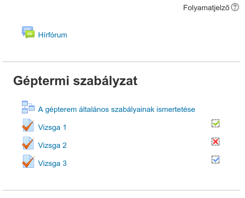
--

<<<

A beállítások:::::

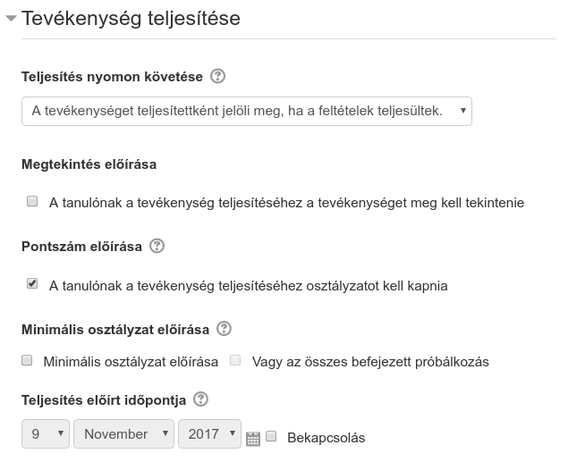
+
A *Teljesítés nyomon követése* mellett válasszuk a *A tevékenységet teljesítettként jelöli meg, ha a feltételek teljesülnek.* opciót. Ekkor a teszt eredményének függvényében lesz teljesített teszt.
+
Ha *csak* a *A tanulónak a tevékenység teljesítéséhez osztályzatot kell kapnia* opciót választjuk, és ha sikeres volt a teszt (elérte a *Pont a teljesítéshez* pontszámot), egy zöld pipa jelenik meg a teszt mellett, egyébként piros X.
+
Ha *csak* a *Minimális osztályzat előírását* választjuk, akkor csak akkor válik teljesítetté a teszt, ha elérte a minimális pontszámot a felhasználó. Ilyenkor kék pipa jelenik meg a teszt mellett, ami csak annyit jelez, hogy teljesített, nincs hozzá sikeresség, sikertelenség kapcsolva.
+
Ha a *A tanulónak a tevékenység teljesítéséhez osztályzatot kell kapnia* és a *Minimális osztályzat* is be van kapcsolva, és ha eléri a felhasználó a teljesítettséghez szükséges pontszámot, megjelenik a zöld pipa, egyébként nem lesz teljesített a teszt. Ha emellé beállítjuk a *Vagy az összes befejezett próbálkozás* opciót, és ha lejár az összes lehetőség és egyik sem volt sikeres, piros X jelenik meg a teszt mellett.

Globális visszajelzés::::

Az megszerzett százaléktól függően meg tudunk jeleníteni a vizsga végén üzenetet a felhasználóknak.
+
[WARNING]
--
Amennyiben beállítottunk teljesítettséghez tartozó pontszámot, akkor az itt megadott sikeres vizsga százaléka egyezzen meg a beállított ponthatárral.
--
+
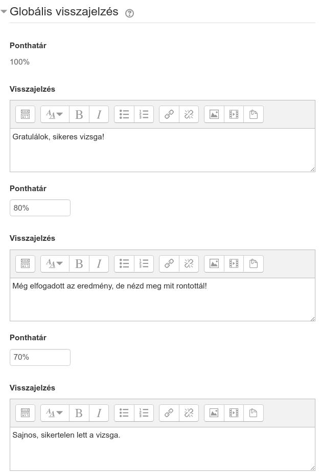

Elrendezés::::

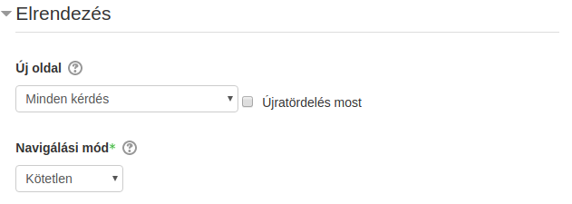
+
A teszt hosszúságától függően érdemes azt beállítani, hogy hány kérdés kerüljön egy
oldalra. 5-8 rövid kérdés kerülhet egy oldalra, de egy 20-30 kérdéses hosszabb gondolkodási
időt igénylő tesztnél célszerű egy oldalra csak 1-2 kérdést tenni. Ezzel lehet megelőzni azt,
hogy a rendszer tétlenség miatt kiléptesse a résztvevőt.

Kérdés viselkedése::::

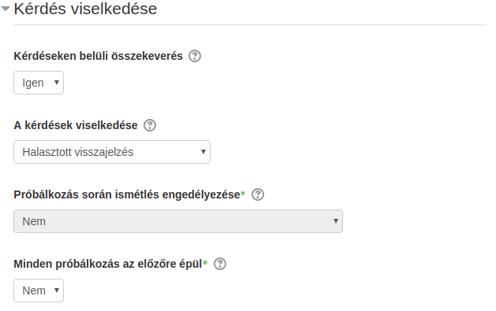
+
A kérdések válaszainak sorrendjét véletlenszerűre állítva még inkább megelőzhető az, hogy a kollégák
egymásnak "`lesúgják`" a válaszokat. A *Kérdéseken belüli összekeverés* is ezt a célt szolgálja.
+
*A kérdések viselkedése* alatt adhatjuk meg, hogy mikor kapjon a felhasználó kiértékelést az egyes kérdésekről. Vizsga esetén *Halasztott visszajelzést* használjunk, gyakorló teszteknél használhatunk *Azonnali visszajelzést*.

<<<

Ellenőrzési lehetőségek::::

image:./pics/tesztek/tesztsor_parameterek_ellenorzesi_lehetosegek.png[]
+
Ezek a lehetőségek szabályozzák, milyen adatokat láthatnak a résztvevők egy teszttel való próbálkozás ellenőrzése vagy tesztjelentések megtekintése során.
+
* A *Próbálkozás alatt* található opcióknak akkor van jelentősége, ha azonnali visszajelzés be van állítva. Azt mondja meg, hogy milyen visszajelzési módok jelenjenek meg a kitöltés közben.
* A *Közvetlenül a próbálkozás után* azt jelenti, hogy két percen belül attól számítva, hogy a résztvevő „Az összes próbálkozás leadása és befejezés” gombra kattint.
* A *Később, amíg a teszt elérhető* azt jelenti, hogy ezt követően, de még a teszt lezárási időpontja előtt.
* *A teszt lezárása után* pedig azt jelenti, hogy azt követően, hogy a teszt lezárási időpontja letelt. Ha a teszthez nincs lezárási időpont, akkor ez az állapot sosem következik be.
+
Az egyes jelölőnégyzetek jelentése:

* *Próbálkozás*: Ha be van jelölve, a felhasználó látni fogja, hogy ő mit válaszolt az adott kérdésre.
* *Ha helyes*: Ha be van jelölve, a felhasználó látni fogja, hogy helyesen vagy helytelenül válaszolt-e a kérdésre.
* *Osztályzat*: Ha be van jelölve, a felhasználó látni fogja, hogy hány pontot ért el a kérdéssel.
* *Egyedi visszajelzés*: A válaszlehetőségekhez van lehetőség megadni egyedi visszajelzéseket a kérdésbankban, ami akkor jelenik meg, ha a felhasználó az adott választ jelölte be. Ha ez az "Egyedi visszajelzés" opció be van jelölve, akkor a felhasználó látni fogja ezeket.
* *Általános visszajelzés*: Ha be van jelölve, akkor a felhasználó látni fogja a teljes kérdéshez megadott visszajelzés szövegét. Ez pl. háttérinformáció lehet a kérdéssel kapcsolatban.
* *Helyes válasz*: Ha be van jelölve, akkor a felhasználó látni fogja, hogy mi lett volna a jó válasz.

Megjelenés::::

Itt tovább finomíthatjuk a megjelenítési beállításokat, pl. bekapcsolhatjuk, hogy a felhasználó képe megjelenjen, illetve a pontszámok hogyan jelenjenek meg.

Külön megszorítások a próbálkozásokhoz::::

Itt köthetjük jelszóhoz, vagy hálózati címhez (pl. hogy csak egy bizonyos teremből legyen elérhető) a tesztünket.

Kérdések felvétele a tesztbe::::

Miután beállítottuk a teszt paramétereit, a menu:Teszt kezelése[Teszt szerkesztése] menüponttal juthatunk a tesztsor összeállításához.
+
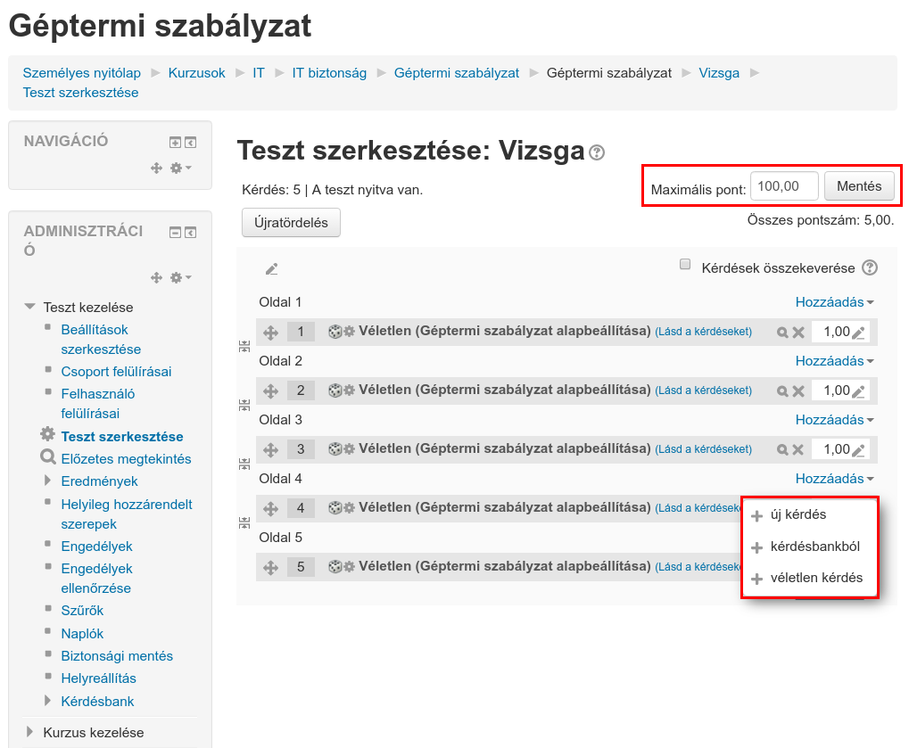
+
Itt a *Hozzáadás* linkre kattintva adhatunk a tesztsorhoz kérdéseket:
+
* *Új kérdés* esetén egy teljesen új kérdést hozhatunk létre az általunk kiválasztott kérdésbankban.
* *Kérdésbankból* opció segítségével a kérdésbankból tudunk kiválasztani meghatározott kérdéseket.
* *Véletlen kérdés* opció segítségével egy kiválasztott kérdésbank kategóriából tudunk megadott számú kérdést hozzáadni a tesztsorhoz.
+
[TIP]
--
Amennyiben vizsgánkat több témakörből szeretnénk felépíteni, hozzunk létre kategóriákat témakörönként, töltsük fel őket kérdésekkel, majd adjuk őket hozzá véletlen kérdésként. Hozzunk létre több kérdést, mint amennyit a vizsgába akarunk szúrni, így a vizsgázok nem ugyanazokat a kérdéseket fogják kapni.
--
+
Állítsuk be a *Maximális pont*-ot. Amennyiben százalékos eredményt szeretnénk kapni, ezt állítsuk be 100-ra.
+
[WARNING]
--
Amikor már a vizsgázás elindult, nem lehet felvenni, illetve eltávolítani kérdéseket a tesztsorról.
--

== Eredmények riportozása

[[grader-report]]
=== Pontok

Amikor a vizsgához tartozik már eredmény, a menu:Teszt kezelése[Eredmények > Pontok] menüpont alatt tudjuk lekérni és exportálni az ezekhez tartozó pontszámokat.

.Riport - Pontok
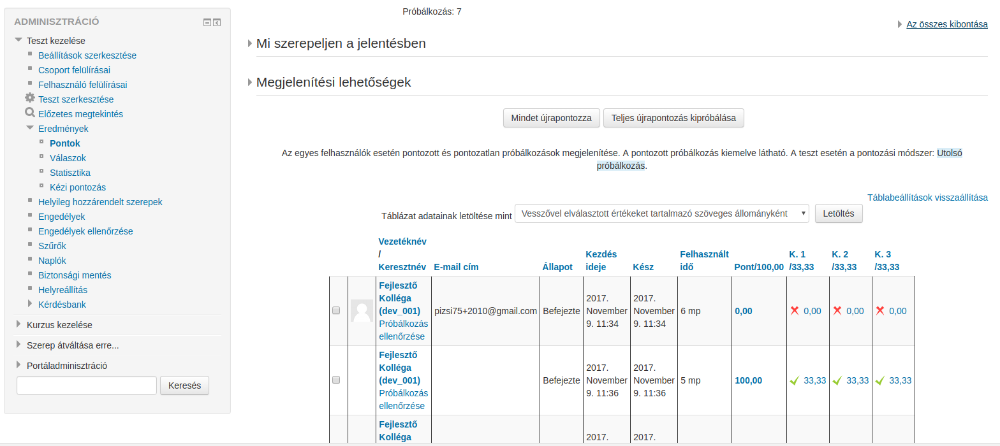

A listában minden próbálkozást - még a folyamatban lévőket is - láthatunk az egyes kérdésekért kapott pontokkal és az összesített pontszámmal. A *Mi szerepeljen a jelentésben* szekció alatt tudjuk megadni, milyen próbálkozások jelenjenek meg a listában.

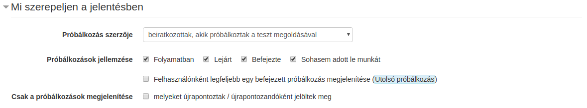

A *Próbálkozások szerzője* mellett választhatjuk ki, hogy mely felhasználók próbálkozásai jelenjenek meg. Amennyiben azt szeretnénk, hogy a kurzus összes hallgatója megjelenjen attól függetlenül, hogy volt-e próbálkozása, válasszuk a *beiratkozottak, akik esetleg próbálkoztak a teszt megoldásával*.

A *Próbálkozások jellemzése* mellett válasszuk a *Lejárt* és *Befejezte* opciókat, amennyiben azt szeretnénk, hogy csak a leadott próbálkozások jelenjenek meg.

Amennyiben egy felhasználótól csak egy próbálkozást szeretnénk megjeleníteni, akkor válasszuk a *Felhasználónként legfeljebb egy próbálkozás megjelenítése* opciót. Ilyenkor a teszt beállításainál megadott *Pontozási módszer* szerinti próbálkozás fog megjelenni. Amennyiben ott *Utolsó próbálkozás*-t jelöltünk be, itt is ez fog megjelenni.

TIP: Ha minden próbálkozás megjelenik egy felhasználótól, a pontozott próbálkozás meg lesz jelölve a listában.

Amennyiben valamiért egy-egy próbálkozást törölni szeretnénk, ezt btn:[A Kiválasztott próbálkozások törlése] gomb segítségével tehetjük meg.

Újrapontozás::::

Amennyiben a vizsgasorban módosítottunk egy kérdésben és a módosítás hatással van a felhasználók pontszámára, akkor újrapontozhatunk minden próbálkozást a btn:[Mindet újrapontozza] gomb segítségével. Lehetőségünk van csak bizonyos próbálkozásokat újrapontozni a btn:[A kiválasztott próbálkozások újrapontozása] segítségével.

=== Válaszok

Amennyiben nem az egyes kérdésekre kapott pontokra vagyunk kíváncsiak, hanem a felhasználók által adott válaszokra, ezt a menu:Teszt kezelése[Eredmények > Válaszok] menüpont alatt tudjuk lekérni.

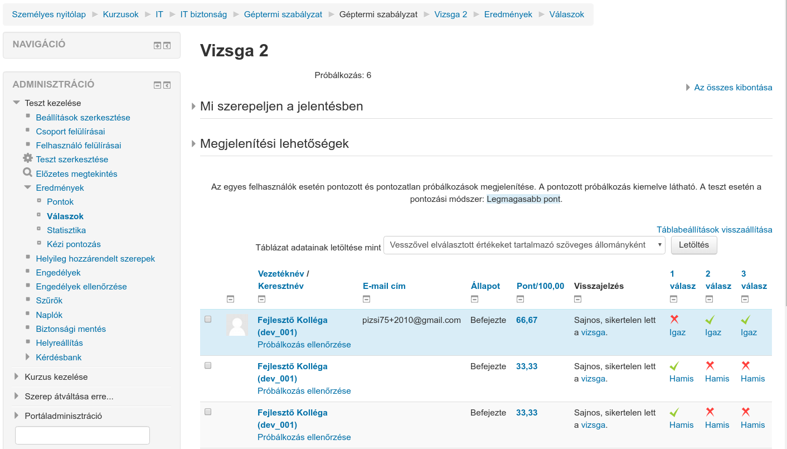

A *Mi szerepeljen a jelentésben* alatt a <<grader-report,Pontoknál>> részletezett módon van lehetőségünk beállítani, hogy mely próbálkozásokat akarjuk látni.

A *Megjelenítési lehetőségek* alatt tudjuk szabályozni, hogy a felhasználó *válaszán* kívül meg akarjuk-e jeleníteni a *kérdés szövegét*, illetve azt, hogy mi volt a *helyes válasz*.

<<<

=== Statisztika

A menu:Teszt kezelése[Eredmények > Statisztika] alatt különböző érdekes statisztikákat kaphatunk a vizsgáról és annak kérdéseiről.

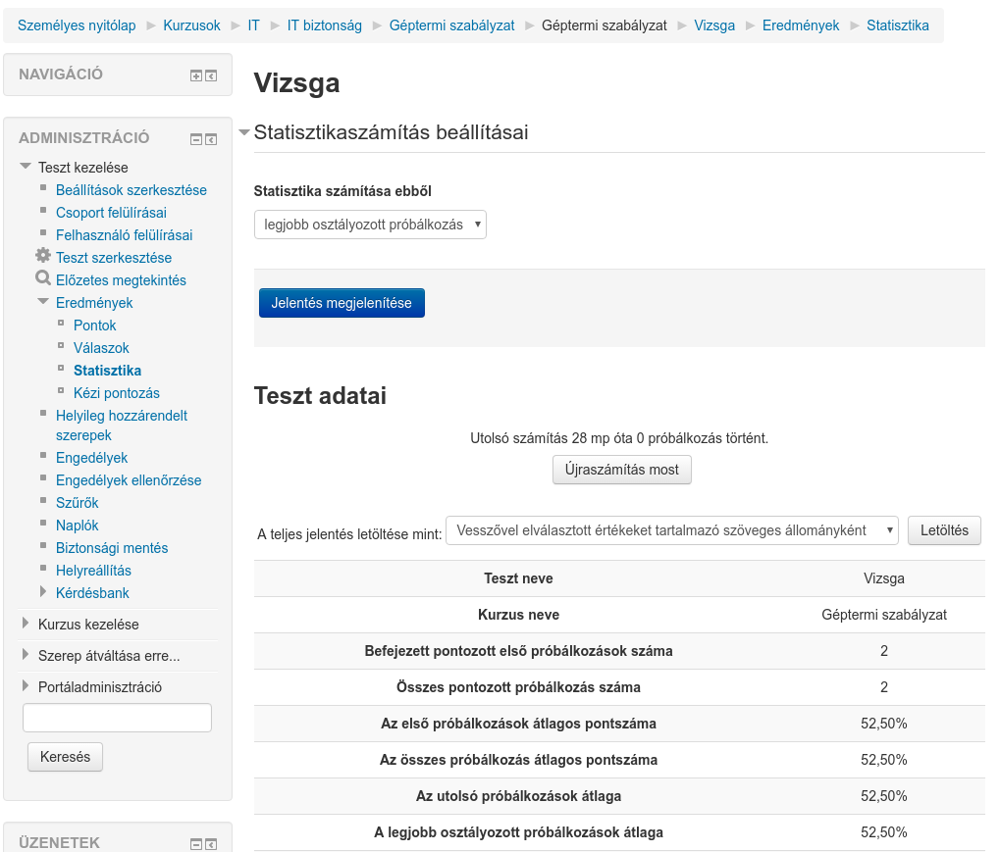

A *Teszt adatai* alatt egy összesítő jelentést találhatunk a próbálkozásokról.

A *Tesztszerkezet elemzése* alatt az egyes kérdésekről kaphatunk érdekes infókat, így láthatjuk, hogy mely kérdéseinket kell esetlegesen még fejlesztenünk.

TIP: Pl. a *Véletlen találgatás pontszáma* azt jelenti, hogy a felhasználók, ha csak találgatnak, hány pontot érhetnek el a kérdéssel, az *Eszközmutató* azt mondja meg, hogy az adott kérdést a felhasználók hány százaléka válaszolta meg jól. A *diszkriminiációs index* minél magasabb, annál jobb, azaz akkor jó egy kérdés, ha azok a tanulók, akik ezt a kérdést jól válaszolták meg, a teljes teszten is jól szerepeltek. Tehát nem egy olyan kérdés, amit tudás nélkül is meg lehet válaszolni.

<<<

=== Kézi pontozás

A menu:Teszt kezelése[Eredmények > Kézi pontozás] alatt van lehetőségünk az esszé kérdéseket pontozni, illetve akár az automatikusan pontozott kérdések pontszámát is felülírhatjuk.

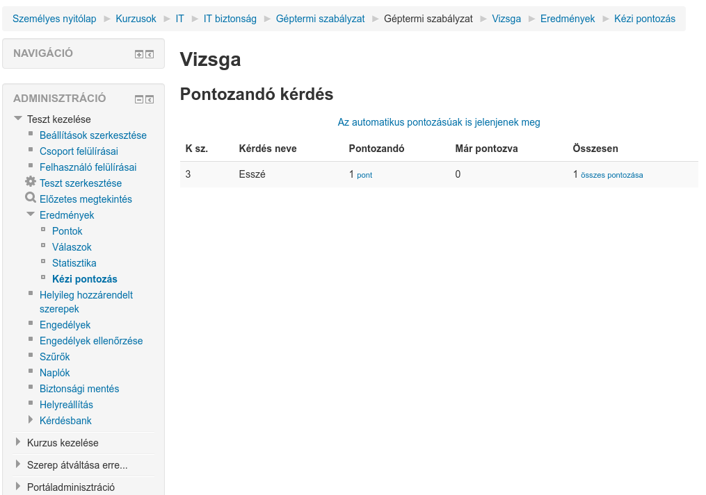
